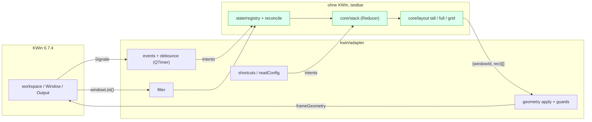
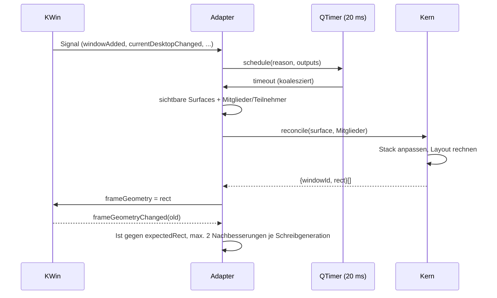

# Implementierungsplan `kwin-xmonad-lite`

Stand: 2026-09-05. Der Entwurf mit allen Nutzerentscheidungen (Abschnitt 12). Umgesetzt sind die Meilensteine 0 bis 3 samt den Stabilisierungsschritten 3.1 und 3.1.1; das Repo liegt unter `github.com/muhackel/kwin-xmonad-lite`, jeder Meilenstein als Feature-Branch mit `--no-ff`-Merge. Der aktuelle Stand steht in Abschnitt 9.

## 0. Position

Das Vorhaben ist als reines KWin-Skript (`X-Plasma-API: javascript`, eigene Geometrieberechnung über `frameGeometry`) mit KWin 6.7.4 sauber machbar. Die KWin-Tile-API scheidet als Backend aus (Abschnitt 2, Punkt 7). Drei Punkte sind mit einem KWin-Skript nur eingeschränkt lösbar und werden entsprechend markiert: Panel-Geometrieänderungen (kein Signal), Wayland-Größenänderungen (asynchron, Client entscheidet) und fehlender Unload-Hook im JS-Modus.

Alle Angaben stammen aus dem Quellcode der gepinnten Version (kwin 6.7.4, nixpkgs `8a37cfb926b31472f2e90b992c197c62d6bb4d74`, lokal auf SPIELKISTE identisch) oder aus den geklonten Referenz-Repos. Modellwissen wurde nicht verwendet.

## 1. Verifizierte Quellen (Abruf 2026-09-05)

| Quelle | Stand | Verwendung |
|---|---|---|
| KWin-Quellcode `kdePackages.kwin.src` aus dem nixpkgs-Pin | 6.7.4 (Qt 6.11.2) | Scripting-API, Geometriepfad, Activities, Per-Output-Desktops, Reload |
| kglobalacceld-Quellcode aus dem Pin | 6.7.4 | Konfliktverhalten bei Shortcuts |
| `~/.config/kglobalshortcutsrc`, `kwinrc`, `kactivitymanagerdrc` auf SPIELKISTE | 2026-09-05 | Konfliktprüfung, Altlasten Krohnkite/Polonium, 4 Desktops, 3 Outputs 2560×1440 |
| `nixosconfig/sources/xmonad/xmonad.hs`, `~/Desktop/xmonad-bindings.md`, `~/Desktop/kde-bindings.md`, `nixosconfig/{CLAUDE.md,flake.nix,flake.lock,modules/user/muhackel/home.nix}` | vorliegend | Ratio 65 %, Schritt 5 %, Layoutreihenfolge, Belegung, Konventionen |
| Polonium `github.com/zeroxoneafour/polonium` `afc713f6` (MIT) | 2026-07-31 | Event-Dedup, Schlüsselbildung, Issues #148/#205/#219/#221/#222/#223 |
| Tessera `github.com/IamAndelib/Tessera` `d66fbad4` (MIT) | 2026-09-03 | Float-Restore, Init-Retry, Tile-API-Crash-Doku, ES-Target-Begründung |
| Aerogel `codeberg.org/bovfbovf/aerogel` `29d16d1c` (GPL-3.0-or-later) | 2026-05-26 | nur Ideen: Filterkette, Gap/minSize-Rechnung, Ist/Soll-Vergleich |
| Krohnkite `codeberg.org/anametologin/Krohnkite` 0.9.9.2 `1d7fd742` (MIT) | 2025-07-25 | Tall-Split, Surface-Schlüssel, Issues #35/#45/#53/#59, PR #37 |
| Karousel `github.com/peterfajdiga/karousel` v0.17 `d14c8fbd` (GPL-3.0) | 2026-06-07 | nur Ideen: KWin-freies Testmuster, Delayer nach Screen-Resize |
| nixpkgs-Derivationen krohnkite/karousel/kzones/dynamic-workspaces/polonium, `nixos/tests/plasma6.nix`, `nixos/tests/cardwire.nix`, Test-Driver | Pin | Packaging, Test-VM |
| plasma-manager `github.com/nix-community/plasma-manager` `a19a2a02` (`modules/kwin.nix`, `shortcuts.nix`, `files.nix`) | trunk | Aktivierung, Shortcuts |
| `develop.kde.org/docs/plasma/kwin/` und `…/api/` | Tutorial; API-Seite dokumentiert **KWin 6.0** | nur Install-Kommandos; `…/packaging/` ist 404 |
| `kde.org/announcements/plasma/6/6.7.0/`, `community.kde.org/Plasma/Plasma_6` | 2026-06-16 | Per-Screen-Desktops bestätigt, ohne technische Details |
| `docs.kde.org` Plasma-Handbuch (Activities-Seite) | Plasma 5.20 | inhaltlich unergiebig, Semantik daher aus KWin-Code |

## 2. KWin-API 6.7.4: Möglichkeiten und Grenzen

### Bestätigte Semantik der Annahmen

- Virtuelle Desktops sind global (eine Liste in `VirtualDesktopManager`). Neu in 6.7: Option `PerOutputVirtualDesktops` (`src/kwin.kcfg:109`, Default aus, nur Wayland). Damit hat jeder Output seinen eigenen *aktuellen* Desktop. Skript: `workspace.currentDesktopForScreen(output)` und `options.perOutputVirtualDesktops`. `currentDesktopChanged(prev, cur, output)` feuert je Output (`src/virtualdesktops.h:463-469`).
- Fenster haben `desktops` (Liste, leer = alle) und `activities` (Liste, leer = alle) getrennt (`src/window.h:349-359`).
- Der Merker „letzter Desktop je Activity" sitzt in KWin selbst (`src/activities.cpp:102-142`, je Activity **und** Output, State-Config-Gruppe `[Activities][PerOutputLastVirtualDesktop]`). Beim Activity-Wechsel stellt KWin die Desktops je Output wieder her, bevor `currentActivityChanged` kommt. Kein kactivitymanagerd-Plugin beteiligt. Für das Skript nicht zugänglich, aber auch nicht nötig.
- Regeln, Activity-, Desktop- und Output-Zuweisung bleiben bei KWin. Das Skript liest sie nur.

### Nutzbare API (Datei:Zeile im 6.7.4-Baum)

- **Workspace** (`src/scripting/workspace_wrapper.h`): `screens`/`screensChanged`, `screenOrder`, `activeScreen` (ohne Notify), `currentDesktop`, `currentDesktopForScreen(output)`, `desktops`, `currentActivity`, `activities`, `activeWindow` (RW), `windowList()`, `clientArea(KWin.MaximizeArea, output, desktop)` (`desktop` wird ignoriert, `workspace_wrapper.cpp:286-293`), `clientArea(option, window)`, `raiseWindow`, `sendClientToScreen`, `screenAt`; Signale `windowAdded/Removed/Activated`, `currentDesktopChanged`, `currentActivityChanged`, `activitiesChanged`, `desktopsChanged`, `screensChanged`, `virtualScreenGeometryChanged`.
- **Window** (`src/window.h`): `frameGeometry` (RW, Write = `moveResize`), `output`, `minSize/maxSize`, `fullScreen` (RW), `minimized` (RW), `maximizeMode` (numerisch 0 Restore, 1 Vertical, 2 Horizontal, 3 Full), `setMaximize(v,h)`, Typ-Booleans (`normalWindow`, `dialog`, `dock`, `splash`, `utility`, `popupWindow`, `specialWindow`, `transient`, `transientFor`, `modal`, `managed`, `deleted`), `resizeable`, `moveable`, `resourceClass`, `resourceName`, `desktopFileName`, `caption`, `internalId`, `move`/`resize`; Signale `frameGeometryChanged(old)`, `outputChanged(old)`, `fullScreenChanged()`, `minimizedChanged()`, `maximizedChanged()` (ohne Argument), `desktopsChanged()`, `activitiesChanged()`, `interactiveMoveResizeStarted/Stepped(rect)/Finished`, `closed()`.
- **Output** (`LogicalOutput`, `src/core/output.h:186-465`): `name` (DRM-Connector wie `DP-1`, konstant), `manufacturer/model/serialNumber`, `geometry`/`geometryChanged`, `devicePixelRatio`. Keine `uuid`, kein `enabled`.
- **Globals im JS-Modus** (`src/scripting/scripting.cpp:193-294`): `readConfig(key, default)` (aus `kwinrc [Script-<Id>]`, In-Memory, Reparse erst bei `reconfigure`), `registerShortcut(objectName, text, keys, cb)` (Komponente `kwin`, Key = objectName; lokal belegt durch 55 tote Einträge in `kglobalshortcutsrc` (35 `Krohnkite*`, 20 `Polonium*`, alle `none,none,…`)), `callDBus` (immer asynchron), `new QTimer()` (`scripting.cpp:218`), `console.log`, `options`, `KWin.ClientAreaOption`. Kein `setTimeout`, kein `unregisterShortcut`. `print()` **existiert** (in Meilenstein 0 gemessen); die Implementierung verwendet trotzdem `console.log`. Die `ClientAreaOption`-Werte liegen **flach als Zahlen** auf `KWin` (`KWin.MaximizeArea === 2`), ein geschachteltes `KWin.ClientAreaOption` gibt es nicht. `MaximizeMode`/`Layer`/`WindowType` sind gar nicht als `KWin.*`-Enum erreichbar, Werte numerisch vergleichen. `Object.keys(KWin)` liefert nichts, auf `workspace`/`Window`/`Output` dagegen schon.

### Grenzen mit Konsequenz für den Entwurf

1. `frameGeometry` schreiben = `Window::moveResize` ohne Min/Max-Klemmung und ohne Maximiert-Prüfung (`src/window.cpp:3412-3420`). Wayland: reine Verschiebung synchron, Größenänderung asynchron per xdg-configure, der Client entscheidet (`src/xdgshellwindow.cpp:262-289`). Folge: nur Layout-Teilnehmer mit `maximizeMode === 0` verschieben, selbst clampen und das Ergebnis über `frameGeometryChanged` prüfen. Maximierte Fenster werden nicht automatisch entmaximiert.
2. Kein Signal für Änderungen der `clientArea` (Panel). Nur `windowAdded/Removed` eines Docks und `virtualScreenGeometryChanged` als Proxy, plus verzögerter zweiter Durchlauf (Muster Karousel `World.ts:34-40`, Krohnkite-Issue #35).
3. Kein Unload-Hook im JS-Modus (`Script::stop` → `deleteLater`, `scripting.cpp:124-127`). Folge: Entwurfsregel „keine dauerhaften Fenster-Eigenschaften ändern" (kein `keepAbove`, keine Desktop-/Activity-Umsetzung). Dann bleibt beim Entladen nichts zurückzurollen.
4. `windowAdded` feuert auch für X11-unmanaged, Layer-Shell und interne Fenster (`src/workspace.cpp:829/873/954/2189`). Filter ist Pflicht.
5. Hotplug-Reihenfolge (`workspace.cpp:1345-1495`): `outputRemoved` → je Fenster `outputChanged` → erst dann `screensChanged`. Objektidentität eines Outputs über Replug ist nicht belegt; Schlüssel ist `output.name`.
6. `reconfigure` lädt laufende Skripte nicht neu (`scripting.cpp:861-866`); der Config-Dialog benachrichtigt KWin nicht (`src/kcms/common/genericscriptedconfig.cpp:190`). Reload nur über D-Bus `org.kde.kwin.Scripting.unloadScript`/`loadScript` und `Script<N>.run`.
7. Tile-API (`rootTile`): Tiles je Output×Desktop ohne Activity, 15 %-Mindestgröße, `split()`-Sibling-Semantik seit 6.4 mit dokumentiertem SIGSEGV (Tessera `docs/STAGE1-HOTFIX.md`), Monocle nicht darstellbar (Polonium-FAQ). Nicht verwenden.
8. ES-Level der QJSEngine (Qt 6.11): **in Meilenstein 0 gemessen, Ergebnis `es2016`**. Am Parser scheitern `async`/`await`, Objekt-Spread und -Rest, `catch {}` ohne Bindung, `??=`/`||=`/`&&=` sowie alle Klassenfelder und statischen Blöcke; `?.` und `??` funktionieren. Bundle-Target ist damit `es2016` (deckt sich mit Tesseras Pin). esbuild liefert keine Polyfills, deshalb sind auch `Object.fromEntries`, `Object.hasOwn`, `Array.prototype.flat/flatMap/at/findLast/toSorted`, `String.prototype.replaceAll/trimStart/matchAll/at`, `Promise.allSettled/any` und `globalThis` gesperrt. Belege in `docs/research.md`.
9. Shortcut-Konflikte werden in kglobalacceld nur als Debug-Meldung geloggt (`src/globalshortcut.cpp:146`). Welche Aktion dann feuert, ist nicht belegt. Konflikte sind zu vermeiden.

## 3. Architektur

Fünf Schichten, drei davon ohne KWin-Abhängigkeit.



| Schicht | Inhalt | KWin-Abhängigkeit |
|---|---|---|
| `core/layout` | `tall(area, n, params)`, `full(area, n, params)`, später `grid`. Eingabe reine Zahlen, Ausgabe `Rect[]` | keine |
| `core/stack` | XMonad-Stack je Surface: geordnete Fenster-IDs, Fokus als **Fenster-ID** (kein Index), Layoutindex, Masteranteil. Die Float-Markierung sitzt je Fenster in der Registry, nicht je Surface (Abschnitt 7). Reine Reducer: `focusNext/Prev`, `focusMaster`, `swapNext/Prev`, `promote`, `insert`, `remove`, `nextLayout`, `resetLayout`, `growMaster`/`shrinkMaster`. Jeder liefert einen **neuen** Zustand; ändert sich nichts, kommt dasselbe Objekt zurück | keine |
| `state` | `SurfaceKey = activity\|desktopId\|outputName`, Registry mit `Map<SurfaceKey, SurfaceState>` und `Map<WindowId, WindowState>`, Reconcile (Ist-Fenstermenge gegen gespeicherte Reihenfolge). Der Behälter ist veränderlich, die Zustände darin nicht | keine |
| `kwin/adapter` | Fensterfilter, Signal-Verdrahtung, Debounce (`QTimer`), Geometrie-Anwendung mit Guards, Output-/Desktop-/Activity-Auflösung, Shortcuts, `readConfig` | KWin |
| `packaging` | `metadata.json`, `contents/config/main.xml`, `main.js` (Bundle), Nix-Flake, Home-Manager-Modul | kpackage, Nix |

Der Adapter erzeugt aus KWin-Signalen nur Intents (`windowAppeared`, `windowVanished`, `focusChanged`, `surfaceChanged`, `arrangeRequested`), die der Kern verarbeitet. Der Kern gibt eine Liste `{windowId, rect}` zurück, die der Adapter anwendet.

## 4. Zustands- und Ereignismodell

### Zustand

- Je **Surface** (Activity × Desktop × Output): `order: WindowId[]`, `focus: WindowId | null`, `layoutIndex`, `masterRatio`.
- Je **Fenster** (global): `floating: boolean`, `floatRect`, `tiledRect`, `expectedRect`, `applyAttempts`, `applyGeneration`. IDs sind `internalId` als String.
- Ein Fenster auf allen Desktops oder mehreren Activities steht in jeder betroffenen Surface-Reihenfolge und wird dort mitgekachelt (Entscheidung 2).
- **Sichtbare Surfaces:** je `output` aus `workspace.screens`: `desktop = currentDesktopForScreen(output)` (Fallback `currentDesktop`), `activity = workspace.currentActivity`. Ohne Per-Output-Option liefert das für alle Outputs denselben Desktop, das Modell bleibt gleich.
- **Surface-Mitglieder:** alle grundsätzlich verwaltbaren Fenster, die Activity, Desktop und Output der Surface zugeordnet sind. Floating-, minimierte, maximierte und Fullscreen-Fenster bleiben Mitglieder und damit in Reihenfolge und Fokuszyklus.
- **Layout-Teilnehmer:** die Teilmenge der Surface-Mitglieder, die weder floating noch minimiert, maximiert oder Fullscreen sind und die `moveable` **und** `resizeable` melden. Nur sie erhalten Layout-Rechtecke.
- Bei `activitiesChanged` und `desktopsChanged` entfernt die Registry Zustände nicht mehr vorhandener Activities und Desktops. Output-Zustände bleiben nach dem Abstecken bis zum Sitzungsende anhand des Outputnamens erhalten, damit ein erneutes Anstecken den vorherigen Zustand wiederherstellt.

### Ereignisfluss



1. Auslöser → `schedule(reason, outputs?)` → Koaleszierung über einen `QTimer`-Single-Shot (ca. 20 ms; Idee Polonium `src/controller/event.ts:200-269`, MIT). Events werden **nicht** verworfen, sondern als „dirty" nachgezogen (Anti-Pattern Polonium `index.ts:69-70`, Krohnkite `kwindriver.ts:342`).
2. `arrange()`: pro sichtbarer Surface die Surface-Mitglieder aus `windowList()` bilden. Der dauerhafte Mitgliedschaftsfilter prüft Fenstertyp, Ausschlussliste, Output, Desktop und Activity, aber nicht Floating, Minimierung, Fullscreen oder Maximierung. `reconcile` gleicht ausschließlich diese Mitgliedermenge gegen die gespeicherte Reihenfolge ab: neue Fenster oberhalb des fokussierten wie XMonads `insertUp`, verschwundene entfernen; Ghost-Purge nur über die Workspace-Liste, nie Eigenschaften toter Objekte lesen (Tessera `driver.ts:239-258`). Danach die Layout-Teilnehmer bestimmen, Layout rechnen und Geometrien anwenden.
3. Anwenden nur auf Layout-Teilnehmer mit `maximizeMode == 0`: Zielrect gegen `frameGeometry` gerundet vergleichen, bei Gleichheit nichts tun; sonst `expectedRect`, `writeGeneration` und Versuchszähler setzen und das **ganze** Rect als Plain-Object `{x,y,width,height}` zuweisen (Teilzuweisung wirkt nicht, Tessera `driver.ts:447-450`). Der Controller hebt eine Maximierung niemals selbst auf. Verlässt ein Fenster die Layout-Teilnahme, werden `expectedRect` und `applyAttempts` sofort gelöscht.
4. `frameGeometryChanged`: ignorieren während eines eigenen Schreibvorgangs an **diesem** Fenster und während `window.move || window.resize`. Der Signalpfad **schreibt nie** — er liest, beruhigt bei Übereinstimmung die Erwartung und plant sonst eine Nachprüfung ein; ein Write innerhalb des Signals wäre ein verschachtelter Write. Die Schreibgeneration gehört zum Fenster und wird nur bei einem neuen Zielwert erhöht: eine Anordnungsepoche ohne eigenen Write darf eine offene Erwartung nicht altern lassen. Weicht schon das unmittelbare Rücklesen nach einem Write ab, wird die Nachprüfung **garantiert** eingeplant, statt auf ein Signal zu warten, das synchron bereits verworfen worden sein kann. Nachgebessert wird ausschließlich im Timerlauf, höchstens einmal je Fenster und Durchlauf und höchstens zweimal je Schreibgeneration; danach Aufgabe bis zum nächsten externen Ereignis (Flatter-Schutz), wobei der zuletzt beobachtete Istwert als akzeptiert festgehalten wird, damit eine verspätete Meldung desselben Werts keinen neuen Zyklus startet. **Allein** dieser Istwert entscheidet über den Nachhall; das zuletzt gewünschte Soll zählt nicht mit, sonst verschluckte der Controller eine fremde Verschiebung genau dorthin. Trifft eine Nachprüfung das Fenster im Ziehen an, fällt die Erwartung ganz weg — bliebe sie offen, schöbe das erste Signal nach dem Loslassen das Fenster ohne Anordnungslauf zurück. Ändert sich die Geometrie eines zuletzt bekannten Layout-Teilnehmers ohne eigenen Write, löst das genau einen entprellten Anordnungslauf aus. `interactiveMoveResizeFinished` → neu anordnen.
5. Auslöser: `windowAdded/Removed`, `windowActivated` (Fokus in der Surface nachführen; in `Full` das aktive Fenster mit `raiseWindow` heben), `currentDesktopChanged` (nur den gemeldeten Output), `currentActivityChanged`, `screensChanged` (Outputliste neu, Zustände überleben am `output.name`), `virtualScreenGeometryChanged`, je Fenster `outputChanged`, `desktopsChanged`, `activitiesChanged`, `minimizedChanged`, `fullScreenChanged`, `maximizedChanged`, `closed`. Auch ausgeschlossene Dock-Fenster werden beobachtet: `frameGeometryChanged` und `outputChanged` lösen ein erneutes Abfragen der `clientArea` aus. Dock-`windowAdded/Removed` und Paneländerungen erhalten zusätzliche Durchläufe nach 500 ms und 1500 ms.
6. Fensterverbindungen werden protokolliert und bei `windowRemoved` getrennt (Idee Aerogel `WorkspaceManager.ts:1292-1312`).
7. Init: erst starten, wenn `workspace.activities` keine Null-UUID mehr enthält (Tessera `controller/index.ts:213-233`, MIT), sonst Retry über `QTimer`.
8. Fokus/Swap/Promote über Shortcuts: Reducer auf der Surface des aktiven Fensters, danach `workspace.activeWindow = …` bzw. `arrange()`.
9. Registry-Bereinigung: nach Änderungen an Activities oder Desktops gültige Schlüssel neu ermitteln und verwaiste Surface-Zustände entfernen. Bei Output-Änderungen wird die Liste aktiver Outputs aktualisiert; Zustände abgesteckter Outputs bleiben bis zum Sitzungsende erhalten. Fensterzustände ohne Eintrag in `windowList()` werden unabhängig vom letzten Signal gelöscht.

### Zustandsübergänge

Fullscreen, maximiert, minimiert und floating: Das Fenster bleibt Surface-Mitglied und in der Reihenfolge, nimmt aber nicht am Layout teil; die übrigen fließen nach. Beim Verlassen des Zustands wird es wieder eingekachelt. Der Controller hebt Maximierung und Fullscreen nie selbst auf. Vor dem Zustandswechsel aus der Layout-Teilnahme löscht er ausstehende Geometrieerwartungen, damit eine verspätete Wayland-Bestätigung das Fenster nicht zurückkachelt.

## 5. Projektstruktur

```
kwin-xmonad-lite/
├── CLAUDE.md, README.md, build.md, PLAN.md, LICENSE (MIT), flake.nix, flake.lock
├── package/                      # KPackage-Wurzel (Build kopiert main.js hinein)
│   ├── metadata.json             # KPlugin.Id "kwin-xmonad-lite", X-Plasma-API javascript
│   └── contents/config/main.xml  # KConfigXT, Gruppe [Script-kwin-xmonad-lite]
├── src/
│   ├── core/{rect,stack,surface}.ts, core/layout/{index,types,tall,full}.ts
│   ├── state/{registry,reconcile}.ts
│   ├── kwin/{globals.d,types,filter,plan,geometry,apply,timer,read,adapter,log}.ts
│   └── main.ts                   # Einstieg, verdrahtet Adapter und Kern
├── tests/                        # node --test, core/, state/ und kwin/ bis zur Snapshot-Grenze
├── dev/probe/probe.js            # Feature-Probe, ES5, nicht Teil des KPackage
├── nix/{package,home-module,devshell,vm-test}.nix
├── scripts/{lib,dev-load,reload,logs,probe}.sh
└── docs/{design,keys,research}.md
```

Kein `contents/ui/config.ui` im MVP; Konfiguration läuft über `kwinrc` und das Nix-Modul. Der KCM-Dialog kommt bei Bedarf in Stufe 2.

## 6. Tall- und Full-Algorithmus

### Tall (XMonad `Tall 1 (5/100) (65/100)`)

- Eingabe: Arbeitsfläche `clientArea(MaximizeArea, output, desktop)`, `n`, `ratio` (Default 0,65, Bereich 0,1–0,9, Schritt 0,05), `gapOuter`, `gapInner`. Das Desktop-Argument ist in KWin 6.7.4 intern wirkungslos, gehört aber zur API-Signatur.
- `n = 0` → leer. Außenabstand einmal vom Rect abziehen. `n = 1` → ganzes Rect.
- Sonst zuerst `availableWidth = w - gapInner`, dann `masterWidth = round(availableWidth × ratio)` und `stackWidth = availableWidth - masterWidth`. So bleibt genau ein Innenabstand zwischen den Spalten und die Gesamtbreite erhalten. Stapelhöhen entstehen per gewichtetem Split mit Floor und Restverteilung (Idee Krohnkite `src/layouts/layoututils.ts:29-56`, MIT); `gapInner` wirkt dabei **einheitlich**, also auch senkrecht zwischen den Stapelzeilen. Zellen und Abstände zerlegen die Fläche zusammen exakt, es entstehen keine Restpixel. Alle Werte sind ganzzahlig.
- **Klemmpolitik für Abstände** (in Meilenstein 1 festgelegt): ein Abstand wird so weit verkleinert, dass jede Zelle mindestens 1 px behält — der Außenabstand auf höchstens `floor((Kante - 1) / 2)`, der Innenabstand auf höchstens `floor((Gesamtlänge - n) / (n - 1))`. Ist die Fläche zu schmal für zwei Spalten, entfällt die Masterspalte und es bleibt ein reiner senkrechter Stapel.
- Der reine Layoutkern kennt keine Fensterbeschränkungen und erzeugt lückenlose, überlappungsfreie Zellen innerhalb der Arbeitsfläche. Der Adapter berücksichtigt anschließend `minSize` und `maxSize`. Passt ein Fenster nicht in seine Zelle, darf die angewandte Geometrie überlappen oder einen Teil der Zelle frei lassen, muss aber innerhalb der `clientArea` verankert bleiben. Dieser Zustand gilt als beschränkungsbedingt und löst keine wiederholten Korrekturversuche aus. Umverteilung an Nachbarn ist Stufe 2.
- Unit-Tests des Layoutkerns prüfen: Zellen und Abstände zerlegen die Fläche exakt, überlappungsfrei und ganzzahlig innerhalb der Fläche, Summe der Stapelhöhen exakt, Master links, Reihenfolge stabil, Idempotenz bei gleicher Eingabe, größeres Verhältnis nie schmalerer Master. Geprüft wird das als Eigenschaftsprüfung über einen erschöpfenden Gittersweep und einen Fuzzer mit festem Seed, ohne Testbibliothek. Adaptertests prüfen Mindest-/Höchstgrößen getrennt und erlauben dabei die dokumentierten Überlappungen oder Freiflächen.

### Full / Monocle

Jedes gekachelte Fenster erhält das ganze Rect (nur Außenabstand). Das fokussierte Fenster wird per `raiseWindow` gehoben; Floating-Fenster der Surface werden danach ebenfalls gehoben, damit sie sichtbar bleiben. Fokus vor/zurück wechselt das sichtbare Fenster.

### Layoutwechsel

Liste `[tall, full]` je Surface, `Meta+Space` zyklisch, Reset setzt Index 0 und Ratio auf Default. Master-Anzahl bleibt fest 1 (XMonads `IncMasterN` ist nicht im geforderten Umfang). `grid` wird in Stufe 2 an die Liste angehängt.

## 7. Floating, Window-Filter und Tastatur

### Filterkette

Der dauerhafte Mitgliedschaftsfilter lautet `managed && !deleted && normalWindow && !specialWindow && !popupWindow && !dialog && !utility && !splash && !dock && !transient && !modal`, danach folgt die Ausschlussliste auf normalisiertem `resourceClass` mit **Vollmatch** (nicht Substring, Anti-Pattern Tessera/Aerogel). Defaults: `krunner`, `yakuake`, `kded6`, `polkit-kde-authentication-agent-1`, `plasmashell`, `xwaylandvideobridge` (Polonium `config.ts:110`), `steam_app_default` (aus der lokalen Krohnkite-Konfiguration). Fenster mit `minSize == maxSize` gelten als fest und werden nicht verwaltet (`maxSize` meldet für „unbegrenzt" `2147483647`).

> **In Meilenstein 3 entschieden:** `moveable` und `resizeable` stehen **nicht** im Mitgliedschaftsfilter, sondern ausschließlich in der Layout-Teilnahme. Ein Fenster im Vollbild meldet beide als `false` (gemessen, `docs/research.md` Abschnitt 2.5); im Mitgliedschaftsfilter hätte es die Surface verlassen und wäre nach dem Vollbild oberhalb des Fokus als neues Fenster zurückgekommen, statt an seinen Platz. Abschnitt 4 und Matrix 12 verlangen das Gegenteil. Auch das gemessene Dock meldet beides als `false` — die Flags taugen empirisch für keine Mitgliedschaftsentscheidung.

Dialoge und Transienten bleiben unberührt; KWin platziert sie über dem Elternfenster. Floating, Minimierung, Maximierung und Fullscreen sind keine Mitgliedschaftskriterien, sondern schalten nur die Layout-Teilnahme ab.

### Floating

Interne Markierung je Fenster, keine KWin-Eigenschaft. Tiled → Float löscht `expectedRect` und behält beim ersten Umschalten die aktuelle Geometrie; existiert bereits eine gespeicherte `floatRect`, wird sie wiederhergestellt. Float → Tiled speichert die aktuelle Float-Geometrie und kachelt das Fenster wieder ein (Idee Tessera `captureState`/`restoreWindow`, MIT). Floating-Fenster bleiben in der Surface-Reihenfolge und im Fokuszyklus, fehlen aber in der Layoutmenge.

### Tastatur (Entscheidung 1: XMonad-Tasten behalten, KDE umlegen)

Geprüft gegen `~/.config/kglobalshortcutsrc` vom 2026-09-05. Die Datei trennt Alternativen mit einem literalen `\t`.

| Funktion | Belegung | objectName | Befund |
|---|---|---|---|
| Fokus vor / zurück | `Meta+J` / `Meta+K` | `xml-focus-next` / `xml-focus-prev` | frei |
| Fenster tauschen | `Meta+Shift+J` / `Meta+Shift+K` | `xml-swap-next` / `xml-swap-prev` | frei |
| Master fokussieren | `Meta+M` | `xml-focus-master` | frei |
| Zum Master machen | `Meta+Return` | `xml-promote` | frei |
| Master verkleinern | `Meta+H` | `xml-shrink` | frei |
| Master vergrößern | `Meta+L` | `xml-expand` | Konflikt ksmserver „Lock Session" → explizite Umlegung in `nixosconfig` nötig |
| Wieder kacheln | `Meta+T` | `xml-sink` | Konflikt KWin „Edit Tiles" → explizite Deaktivierung in `nixosconfig` nötig |
| Float umschalten | `Meta+Shift+T` | `xml-toggle-float` | frei |
| Layout wechseln | `Meta+Space` | `xml-next-layout` | frei |
| Layout zurücksetzen | `Meta+Shift+Space` | `xml-reset-layout` | frei |

Unangetastet bleiben `Meta+1..4`, `Meta+!@#$`, `Meta+Gravis` (Yakuake), `Meta+Tab`, `Meta+Shift+Tab`. `Meta+Alt+K`/`Meta+Alt+L` sind nur deaktivierte KDE-Defaults. Die objectNames sind ab dem ersten Release stabil, sonst entstehen Leichen wie die 55 Krohnkite-Zeilen. Das Projektmodul registriert ausschließlich seine eigenen Aktionen und verändert keine fremden KDE-Shortcuts. Die Integration in `nixosconfig` setzt `[ksmserver] Lock Session` explizit auf `Screensaver` und `Ctrl+Alt+L` und `[kwin] Edit Tiles` auf `none`, bevor das Skript aktiviert wird.

## 8. Nix-Build- und Testkonzept

- **Werkzeuge nur aus dem nixpkgs-Pin** (verifiziert): `typescript` 5.9.3 (Typprüfung `tsc --noEmit --strict`), `esbuild` 0.27.2 (Bundle `--bundle --format=iife --target=es2016 --outfile=package/contents/code/main.js`; Target in Meilenstein 0 gemessen), `nodejs` 24.19 (`node --test` mit nativem Type-Stripping für `tests/*.test.ts`; nur löschbare TS-Syntax, keine `enum`/`namespace`), `biome` 2.5.11 (Lint/Format ohne npm; Unterkommando `check`, ein `ci` gibt es nicht). Kein `package-lock.json`, kein `npmDepsHash`. Muster: nixpkgs-Karousel-Derivation, nur mit esbuild statt `tsc --outFile`.
- **Paket:** `stdenv.mkDerivation`, Build = Typcheck + Tests + Bundle, Install = `cp -r package $out/share/kwin/scripts/kwin-xmonad-lite` (Polonium-Muster in nixpkgs `pkgs/by-name/po/polonium/package.nix:40-41`; `kpackagetool6 --packageroot` als Alternative). Der Store-Pfad landet über `XDG_DATA_DIRS` (`/etc/profiles/per-user/muhackel/share`) in KWins Suchpfad `kwin/scripts/` (`scripting.cpp:757-760`).
- **Flake-Outputs:**
  - `packages.default`: Skriptpaket.
  - `apps.default` (`nix run`): baut das Paket und lädt das gebaute `main.js` über KWins Scripting-D-Bus direkt aus dem Store. Vorher wird eine laufende Entwicklungsinstanz beendet; ist die deklarativ aktivierte Produktionsinstanz geladen, bricht der Wrapper mit einer verständlichen Meldung ab. Es entsteht keine Kopie unter `~/.local/share`, die später das Nix-Profil überschattet.
  - `apps.reload`: lädt ausschließlich die Entwicklungsinstanz aus dem aktuellen Store-Pfad neu: `unloadScript <dev-id>` → `loadScript <store-pfad>/contents/code/main.js <dev-id>` → `/Scripting/Script<N> org.kde.kwin.Script.run`. Der von `loadScript` gelieferte numerische Bezeichner wird ausgewertet, nicht geraten.
  - `apps.logs`: `journalctl --user -u plasma-kwin_wayland -f`.
  - `devShells.default`: alle Tools plus `kdePackages.kpackage`, `kdePackages.qttools` (liefert `qdbus`), `kdePackages.kconfig` (`kwriteconfig6`).
  - `checks`: Build, Tests, Lint, Typcheck; `nix flake check` grün.
  - `homeManagerModules.default`.
- **Home-Manager-Modul:** plasma-manager ist ein expliziter, an Home Manager und nixpkgs gekoppelter Flake-Input. Das Modul bietet `enable`, `settings` und `shortcuts`, installiert das Paket und setzt nur `programs.plasma.configFile."kwinrc".Plugins."kwin-xmonad-liteEnabled"`, die eigene Gruppe `[Script-kwin-xmonad-lite]` sowie `programs.plasma.shortcuts.kwin.<objectName>`. Es verwendet keine imperativen `home.activation`-Schreibzugriffe. Eine optionale `relocateKdeShortcuts`-Schnittstelle hat Default `false`; bevorzugt bleibt die Umlegung vollständig in der Host-Konfiguration.
- **Einbindung in `nixosconfig`:** Flake-Input `kwin-xmonad-lite` mit `inputs.nixpkgs.follows = "nixpkgs"` und passender Home-Manager-/plasma-manager-Kopplung, Modul in `home-manager.sharedModules`, Aktivierung unter dem Feature-Flag `plasma6`. Der lokale Projektpfad ist `/home/muhackel/Documents/Projects/kwin-xmonad-lite`; nur die spätere GitHub-URL bleibt offen. `nixosconfig` enthält die hostübergreifende KDE-Shortcut-Politik einschließlich der beiden Konfliktauflösungen.
- **Test-VM (Entscheidung 3):** Im MVP ein Wayland-Smoke-Test mit einem Output: Autologin, `org.kde.kwin.Scripting.isScriptLoaded`, Journal ohne `kwin_scripting`-Fehler. Ein zusätzlich geladenes Test-Probe-Skript liest `workspace.windowList()` und schreibt Fenster-IDs, Surface-Zuordnung und Geometrien als auswertbares JSON ins Journal; der Test-Driver prüft mindestens Einzelfenster und Tall-Aufteilung statt nur einen Screenshot. Der nixpkgs-Plasma-6-Test läuft auf X11 und `wait_for_window` ist X11-gebunden (`nixos/lib/test-driver/.../machine/__init__.py:1488-1493`). Zwei Outputs über `-vga none -device virtio-gpu-pci,max_outputs=2` (`nixos/tests/cardwire.nix:17-23`) sind ein Stufe-2-Experiment, weil nicht belegt ist, ob KWin-Wayland den zweiten Output in der VM als verbunden zeigt. Bis dahin ist der dokumentierte Test auf SPIELKISTE mit mindestens zwei der drei Outputs Teil der MVP-Abnahme.

## 9. Phasenplan

| MS | Inhalt | Prüfbar durch |
|---|---|---|
| 0 | **erledigt 2026-09-05.** Repo-Gerüst mit CLAUDE.md, README.md und build.md, Flake, `docs/research.md` mit URLs/Commits, `nix flake check`, Feature-Probe auf SPIELKISTE gelaufen (682 Sätze, Rohdaten im Repo) | Journal zeigte die Probe-Ausgabe, Check grün |
| 1 | **erledigt 2026-09-05.** `core/rect`, `core/layout/tall`, `core/layout/full`, Unit-Tests mit Eigenschaftsprüfung (2025 Gitter- und 500 Fuzz-Fälle) | `node --test` grün (27 Tests) |
| 2 | **erledigt 2026-09-05.** `core/stack`, `core/surface`, `state/registry`, `state/reconcile`, Tests für Fokus/Swap/Promote/Insert/Purge/Sticky | Tests grün (73 Tests) |
| 3 | **erledigt 2026-09-05.** Adapter: Mitgliedschaft und Layout-Teilnahme getrennt, Surface-Auflösung, Debounce, Geometrie-Anwendung mit Generation/Guards. Die Surface-Auflösung beherrscht bereits mehrere Ausgaben und Sticky-Fenster; die Abnahme lief auf einer Ausgabe | Tests grün (138), Matrix 1–2, kein Flattern im Journal |
| 3.1 | **erledigt 2026-09-05.** Stabilisierung des Schreib- und Prüfpfads: Schreibgeneration je Fenster statt je Anordnungsepoche, garantierte Nachprüfung nach abweichendem Rücklesen, Nachbessern ausschließlich im Timerlauf, fremde Geometrieänderungen lösen einen Lauf aus, `full` hebt nur Layout-Teilnehmer | Tests grün (164), vier Mutationsproben erkannt, Signalfolgen im Unit-Test |
| 3.1.1 | **erledigt 2026-09-05.** Nachschlag am Geometriecontroller: Nachprüfungstimer stoppt sich selbst statt auf `singleShot` zu bauen, `settle`/`forget`/`giveup` räumen den Eintrag über `cancelRecheck` ab, der Nachhall hängt allein an `lastObservedRect`, eine Nachprüfung im Ziehen lässt die Erwartung fallen | Tests grün (170), fünf Mutationsproben erkannt, Reload und externe Verschiebung auf SPIELKISTE |
| 4 | Multi-Output, Desktopwechsel, Hotplug, Registry-GC, Dock-Geometriesignale, Panel-Proxy, Per-Output-Desktops feature-detected | Matrix 3–5, 9–10 auf SPIELKISTE (3 Outputs) |
| 5 | Zustandsübergänge Fullscreen/Maximiert/Minimiert, Float-Toggle, Dialoge, Mindestgrößen | Matrix 11–15 |
| 6 | Eigene Shortcuts, `readConfig`, plasma-manager-basiertes Home-Manager-Modul, `nix run` ohne lokale Schattenkopie; KDE-Konflikte explizit in `nixosconfig` | Einbindung in `nixosconfig` als Feature-Branch |
| 7 | Wayland-Smoke-VM mit Geometrie-Probe, Reload-/Neustart-Verhalten, dokumentierter Multi-Output-Lauftest, MVP-Abnahme | Matrix 1–5 und 16–17 |
| 8 (Stufe 2) | `grid`, Activities-Tests, Zwei-Output-VM-Experiment, optionale Persistenz, KCM-Dialog nur bei Bedarf | Matrix 6–8, Grid-Abnahme |

Jeder Meilenstein ist ein Feature-Branch mit `--no-ff`-Merge auf `main`, keine Entwicklungs-Commits auf `main`, keine `Co-Authored-By`-Zeilen. `CLAUDE.md`, `README.md` und `build.md` werden vor jedem Merge geprüft.

## 10. Risiken und offene technische Fragen

1. **Wayland-Größe unverbindlich:** Clients mit eigenem Größenraster (Terminals, GTK-Dialoge) liefern abweichende Größen. Gegenmaßnahme: Toleranz plus begrenzte Nachbesserung. Rest bleibt sichtbar.
2. **Panel-Timing:** Beim Login erscheint das Panel nach dem Skript; ohne direktes `clientArea`-Signal bleiben Dock-`frameGeometryChanged`, `outputChanged`, Verzögerung und `windowAdded` nur Proxys. Nicht garantiert.
3. ~~ES-Level und `print()` der QJSEngine~~ **erledigt in MS 0**: Target `es2016`, `print()` existiert, `setTimeout` nicht. Neu aufgetaucht: `windowList()`, `desktops` und `activities` sind array-artig, aber keine echten Arrays — `map`/`filter` sind darauf nicht verwendbar. Beim erneuten Durchsehen der Rohdaten in MS 3 fielen zwei Fehler in `docs/research.md` auf: `QTimer.restart` existiert **nicht**, und benannte Regex-Gruppen parsen zwar, füllen aber `match.groups` nicht. Beides dort korrigiert.
4. **`registerShortcut` bei belegter Taste:** nur Debug-Log. Deshalb konfliktfreie Belegung durch eine explizite, vom Projekt getrennte Host-Konfiguration.
5. **Output-Identität:** `name` ist portstabil; beim Umstecken auf einen anderen Port wandert der Zustand nicht mit. Akzeptiert.
6. **Kein Unload-Hook:** durch die Regel „keine dauerhaften Eigenschaften" entschärft; beim Deaktivieren bleiben Fenster dort, wo sie sind.
7. **Fenster auf allen Activities:** leere Liste bedeutet „alle" (Polonium-Issue #222). Der Reconcile behandelt das explizit.
8. **Re-Enable ohne Relogin** scheitert laut Tessera-README auf 6.6–6.8 bei QML-Skripten; ob der JS-Modus betroffen ist, klärt MS 7.
9. **Persistenz:** `readConfig` ist lesend; Schreiben ginge nur über `callDBus` oder eine eigene Datei. Stufe 2.
10. **Zweiter VM-Output:** Verhalten von KWin-Wayland mit `virtio-gpu max_outputs=2` nicht belegt. Stufe 2.
11. **Lokale Schattenkopie:** Eine Installation unter `~/.local/share/kwin/scripts` würde ein deklaratives Store-Paket überlagern. Die vorgesehenen `nix run`-/Reload-Apps laden deshalb direkt aus dem Store und legen dort keine Kopie ab.

## 11. Abnahmekriterien und Testmatrix

**MVP abgenommen, wenn:** alle Punkte des MVP-Umfangs laufen, die Testmatrix bis auf die markierten Fälle besteht, `nix flake check`, `nix shell`, `nix run` funktionieren, das Home-Manager-Modul in `nixosconfig` aktiviert ist, die VM-Probe die erwarteten Geometrien aus dem Journal bestätigt, ein dokumentierter Lauf mit mindestens zwei Outputs auf SPIELKISTE bestanden ist und im Journal über eine Stunde normaler Arbeit keine Geometrie-Schleife (mehr als 3 Anwendungen desselben Fensters ohne Nutzeraktion) auftritt.

**Grid-Stufe abgenommen, wenn:** `grid` in der Layoutliste zyklisch erreichbar ist, die Unit-Tests dieselben Eigenschaften wie Tall prüfen, und Fälle 6–8 der Matrix bestehen.

| # | Fall | Erwartung | Reines Skript |
|---|---|---|---|
| 1 | 1 Bildschirm, 1 Fenster | volle Fläche minus Außenabstand | ja |
| 2 | 1 Bildschirm, n Fenster | Tall 65/35, Stapel lückenlos | ja |
| 3 | 2 Bildschirme, unabhängige Stapel | getrennte Reihenfolge, Ratio, Layout je Output | ja |
| 4 | 4 virtuelle Desktops | 4 Zustände je Output, keine Desktop-Namen im Code | ja |
| 5 | Desktopwechsel mit offenen Fenstern | Reflow nur des gemeldeten Outputs | ja |
| 6 | zweite Activity | eigener Zustand je Activity, keine Activity-Erstellung | ja (Stufe 2 getestet) |
| 7 | Fenster auf allen Desktops | in jeder Surface mitgekachelt | ja |
| 8 | Fenster auf mehreren Activities | in jeder Surface mitgekachelt | ja |
| 9 | Bildschirm an-/abstecken | Zustand überlebt am Namen; Fenster folgen KWins Zuordnung | ja |
| 10 | Panel ändert nutzbare Fläche | Reflow nach Dock-Geometriesignal/Proxy und Verzögerung | **eingeschränkt** (kein direktes `clientArea`-Signal) |
| 11 | Dialog/Popup über gekacheltem Fenster | unberührt | ja |
| 12 | echtes Fullscreen | verlässt Tiling, Rest fließt nach, Rückkehr kachelt | ja |
| 13 | minimiert und wiederhergestellt | dito | ja |
| 14 | Float-Toggle und Wiedereinkacheln | Geometrie gemerkt, Reihenfolge erhalten | ja |
| 15 | Fenster mit Mindest-/Höchstgröße | Beschränkung respektiert, dokumentierte Überlappung/Freifläche, kein Flattern | **eingeschränkt** (Client entscheidet) |
| 16 | Script-Reload | Zustand neu aus Ist-Menge, keine Rückstände | ja (Zustand verloren, Persistenz Stufe 2) |
| 17 | KWin-/Sitzungsneustart | wie 16 nach Init-Retry | ja (Zustand verloren) |

## 12. Entscheidungen (2026-09-05)

| Frage | Entscheidung |
|---|---|
| Shortcut-Konflikte `Meta+L` / `Meta+T` | XMonad-Tasten behalten; Projektmodul verändert fremde Shortcuts standardmäßig nicht. `nixosconfig` setzt „Lock Session" auf `Screensaver` und `Ctrl+Alt+L` und leert KWin „Edit Tiles" explizit. |
| Fenster auf allen Desktops / mehreren Activities | in jeder Surface mitkacheln (XMonad `copyToAll`-Verhalten) |
| Test-VM im MVP | Wayland-Smoke-Test mit einem Output; Zwei-Output-VM als Stufe-2-Experiment |
| `moveable`/`resizeable` im Filter (Meilenstein 3) | nur bei der Layout-Teilnahme prüfen, nicht bei der Mitgliedschaft (Begründung in Abschnitt 7) |
| Testschnitt des Adapters (Meilenstein 3) | Snapshot-Grenze: der Adapter liest KWin einmal in schlichte Datensätze aus, Filter, Zuordnung, Anordnung und Geometriewächter sind reine Funktionen darauf und laufen unter `node --test` |
| Wer nachbessert (Meilenstein 3.1) | ausschließlich der Recheck-Timer, höchstens einmal je Fenster und Durchlauf. Der Signal-Callback liest, beruhigt und plant — er schreibt nie, sonst entstünde ein Write innerhalb von `frameGeometryChanged`. |
| Nachhall nach dem Aufgeben (Meilenstein 3.1) | eigenes Feld `lastObservedRect` statt erweitertem `tiledRect`: nach einem Giveup fallen Soll und Ist auseinander, und `tiledRect` trägt ab Meilenstein 5 die Rückkehr aus dem Float. |
| Woran der Nachhall erkannt wird (Meilenstein 3.1.1) | allein an `lastObservedRect`. `tiledRect` zählt nicht mit: im Gutfall sind beide gleich, nach einem Giveup wäre eine fremde Verschiebung genau auf das nie erreichte Soll sonst verschluckt. |
| `stale` im Nachprüfungslauf (Meilenstein 3.1.1) | bleibt stehen, obwohl praktisch unerreichbar, seit `settle` und `forget` den Eintrag selbst abräumen — Netz für die höhere Auslösedichte ab Meilenstein 4, `judgeRecheck` prüft es weiterhin. |

Vom Planer entschieden und oben begründet: JS-Modus statt QML, keine Tile-API, keine dauerhaften Fenster-Eigenschaften, Maximiert verlässt das Tiling wie Fullscreen und wird vom Controller nicht aufgehoben, neue Fenster oberhalb des Fokus wie XMonad, Master-Anzahl fest 1, kein KCM-Dialog im MVP.

## Anhang: Herkunft übernommener Ideen

| Idee | Quelle | Lizenz | Übernahme |
|---|---|---|---|
| Event-Koaleszierung mit Single-Shot-Timer, Dedup | Polonium `src/controller/event.ts:200-269` | MIT | Idee, eigener Code |
| Surface-Schlüssel `desktop.id` + Activity-UUID + `output.name` | Polonium `event.ts:26-32`; Krohnkite `kwinsurface.ts:32-41` | MIT | Idee |
| Leere `activities`/`desktops` = alle | Polonium-Issue #222 | – | Regel |
| Ghost-Purge nur über Workspace-Liste | Tessera `driver.ts:239-258` | MIT | Idee |
| Float-Geometrie sichern/wiederherstellen | Tessera `extensions.ts:119-132` | MIT | Idee |
| Init-Retry bis Activities geladen | Tessera `controller/index.ts:213-233` | MIT | Idee |
| esbuild-Target unter ES2022 wegen QJSEngine | Tessera `Makefile:43-47` | MIT | Begründung |
| Gewichteter Split mit Floor + Restverteilung | Krohnkite `layoututils.ts:29-56` | MIT | Idee |
| Ratio-Grenzen und Schritt | Krohnkite `tilelayout.ts:22-23`; xmonad.hs `delta = 5/100` | MIT / eigene Config | Werte |
| Filterkette `managed && normalWindow && …` | Aerogel `WindowFilter.ts:64-75` | GPL-3.0 | nur Idee, kein Code |
| Ist/Soll-Vergleich in `frameGeometryChanged`, Ignorieren während Drag | Aerogel `WorkspaceManager.ts:393-415` | GPL-3.0 | nur Idee |
| Automatisches Entmaximieren vor Geometrie-Write | Aerogel `WindowNode.ts:76-78`; KWin `window.cpp:3760-3766` | GPL-3.0 / KWin-Code | geprüft, für den Controller verworfen; maximierte Fenster verlassen das Layout |
| Verzögerter zweiter Durchlauf nach Screen-/Panel-Änderung | Karousel `World.ts:34-40` | GPL-3.0 | nur Idee |
| KWin-freies Testmuster (Globals im Test ersetzt) | Karousel `src/tests/utils` | GPL-3.0 | nur Idee |
| Store-Install per `cp` nach `share/kwin/scripts/<id>` | nixpkgs `polonium/package.nix:40-41` | MIT | Muster |
