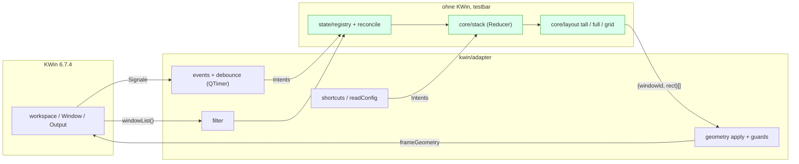

# Implementierungsplan `kwin-xmonad-lite`

Stand: 2026-09-12. Der Entwurf mit allen Nutzerentscheidungen steht in Abschnitt 12. Abgeschlossen sind die Meilensteine 0 bis **7.2** samt den Stabilisierungsschritten 3.1, 3.1.1, 4.1, 4.1.1, 5.1, den Audits 4.2, 6.1, 6.2 und 7.1 sowie den Abnahmen 6.3 und 7. **Der MVP ist abgenommen** — ausgesetzt am 2026-09-06 nach einem externen Audit, das Defekte in den **Prüfwerkzeugen** fand, und nach deren Berichtigung und einer vollständigen Neuauswertung aller Artefakte wieder ausgesprochen. Der Controller war von diesen Auditdefekten nicht betroffen; bis einschließlich Meilenstein 7.2 blieb `src/` gegenüber `abdffa2` unverändert. Meilenstein 8 ergänzt Grid und ist automatisch sowie auf HAL9000 live geprüft; die persönliche Nutzerabnahme bleibt davon getrennt. Jeder archivierte Nachweis besteht auch die verschärften Prüfer (Abschnitt 11). Fall 20c ist nicht offen, sondern **nicht herstellbar** (`docs/research.md` 6.8). Eine Test-VM gibt es nicht mehr, weder im MVP noch auf Stufe 2 (Abschnitt 8). Das Repo liegt unter `github.com/muhackel/kwin-xmonad-lite`, jeder Meilenstein läuft als Feature-Branch mit `--no-ff`-Merge. Der aktuelle Stand steht in Abschnitt 9.

## 0. Position

Das Vorhaben ist als reines KWin-Skript (`X-Plasma-API: javascript`, eigene Geometrieberechnung über `frameGeometry`) mit KWin 6.7.4 sauber machbar. Die KWin-Tile-API scheidet als Backend aus (Abschnitt 2, Punkt 7). Drei Punkte sind mit einem KWin-Skript nur eingeschränkt lösbar und werden entsprechend markiert: Änderungen der Arbeitsfläche (kein eigenes Signal; messbar nur über Dock-Proxys und verzögerte Nachläufe, Abschnitt 2, Punkt 2), Wayland-Größenänderungen (asynchron, Client entscheidet) und fehlender Unload-Hook im JS-Modus.

Alle Angaben stammen aus dem Quellcode der gepinnten Version (kwin 6.7.4, nixpkgs `8a37cfb926b31472f2e90b992c197c62d6bb4d74`, lokal auf SPIELKISTE identisch) oder aus den geklonten Referenz-Repos. Modellwissen wurde nicht verwendet.

## 1. Verifizierte Quellen (Abruf 2026-09-05)

| Quelle | Stand | Verwendung |
|---|---|---|
| KWin-Quellcode `kdePackages.kwin.src` aus dem nixpkgs-Pin | 6.7.4 (Qt 6.11.2) | Scripting-API, Geometriepfad, Activities, Per-Output-Desktops, Reload |
| kglobalacceld-Quellcode aus dem Pin | 6.7.4 | Konfliktverhalten bei Shortcuts |
| `~/.config/kglobalshortcutsrc`, `kwinrc`, `kactivitymanagerdrc` auf SPIELKISTE | 2026-09-05 | Konfliktprüfung, Altlasten Krohnkite/Polonium, 4 Desktops, 3 Outputs 2560×1440 |
| `nixosconfig/sources/xmonad/xmonad.hs`, `~/Desktop/xmonad-bindings.md`, `~/Desktop/kde-bindings.md`, `nixosconfig/{CLAUDE.md,flake.nix,flake.lock,modules/user/muhackel/home.nix}` | vorliegend | Ratio 65 %, Schritt 5 %, Layoutreihenfolge, Belegung, Konventionen |
| XMonad-Contrib `XMonad/Layout/Grid.hs` am Pin `a60c385b92bf3ab54e08d6b22c6602f8fee3b9b7` | 2026-09-12 gelesen | Grid-Zielverhältnis 16:9, Spaltenwahl und spaltenweise Reihenfolge als mathematische Idee |
| Polonium `github.com/zeroxoneafour/polonium` `afc713f6` (MIT) | 2026-07-31 | Event-Dedup, Schlüsselbildung, Issues #148/#205/#219/#221/#222/#223 |
| Tessera `github.com/IamAndelib/Tessera` `d66fbad4` (MIT) | 2026-09-03 | Float-Restore, Init-Retry, Tile-API-Crash-Doku, ES-Target-Begründung |
| Aerogel `codeberg.org/bovfbovf/aerogel` `29d16d1c` (GPL-3.0-or-later) | 2026-05-26 | nur Ideen: Filterkette, Gap/minSize-Rechnung, Ist/Soll-Vergleich |
| Krohnkite `codeberg.org/anametologin/Krohnkite` 0.9.9.2 `1d7fd742` (MIT) | 2025-07-25 | Tall-Split, Surface-Schlüssel, Issues #35/#45/#53/#59, PR #37 |
| Karousel `github.com/peterfajdiga/karousel` v0.17 `d14c8fbd` (GPL-3.0) | 2026-06-07 | nur Ideen: KWin-freies Testmuster, Delayer nach Screen-Resize |
| nixpkgs-Derivationen krohnkite/karousel/kzones/dynamic-workspaces/polonium, `nixos/tests/plasma6.nix`, `nixos/tests/cardwire.nix`, Test-Driver | Pin | Packaging, Test-VM |
| plasma-manager `github.com/nix-community/plasma-manager` `a19a2a02` (`modules/kwin.nix`, `shortcuts.nix`, `files.nix`) | trunk | Aktivierung, Shortcuts |
| `develop.kde.org/docs/plasma/kwin/` und `…/api/` | Tutorial; API-Seite dokumentiert **KWin 6.0** | nur Install-Kommandos; `…/packaging/` ist 404 |
| `kde.org/announcements/plasma/6/6.7.0/`, `community.kde.org/Plasma/Plasma_6` | 2026-06-16 | Per-Screen-Desktops bestätigt, ohne technische Details |
| `docs.kde.org` Plasma-Handbuch (Activities-Seite) | Plasma 5.20 | inhaltlich unergiebig, Semantik daher aus KWin-Code |

## 2. KWin-API 6.7.4: Möglichkeiten und Grenzen

### Bestätigte Semantik der Annahmen

- Virtuelle Desktops sind global (eine Liste in `VirtualDesktopManager`). Neu in 6.7: Option `PerOutputVirtualDesktops` (`src/kwin.kcfg:109`, Default aus, nur Wayland). Damit hat jeder Output seinen eigenen *aktuellen* Desktop. Skript: `workspace.currentDesktopForScreen(output)` und `options.perOutputVirtualDesktops`. `currentDesktopChanged(prev, cur, output)` feuert je Output (`src/virtualdesktops.h:463-469`).
- Fenster haben `desktops` (Liste, leer = alle) und `activities` (Liste, leer = alle) getrennt (`src/window.h:349-359`).
- Der Merker „letzter Desktop je Activity" sitzt in KWin selbst (`src/activities.cpp:102-142`, je Activity **und** Output, State-Config-Gruppe `[Activities][PerOutputLastVirtualDesktop]`). Beim Activity-Wechsel stellt KWin die Desktops je Output wieder her, bevor `currentActivityChanged` kommt. Kein kactivitymanagerd-Plugin beteiligt. Für das Skript nicht zugänglich, aber auch nicht nötig.
- Regeln, Activity-, Desktop- und Output-Zuweisung bleiben bei KWin. Das Skript liest sie nur.

### Nutzbare API (Datei:Zeile im 6.7.4-Baum)

- **Workspace** (`src/scripting/workspace_wrapper.h`): `screens`/`screensChanged`, `screenOrder`, `activeScreen` (ohne Notify), `currentDesktop`, `currentDesktopForScreen(output)`, `desktops`, `currentActivity`, `activities`, `activeWindow` (RW), `windowList()`, `clientArea(KWin.MaximizeArea, output, desktop)` (`desktop` wird ignoriert, `workspace_wrapper.cpp:286-293`), `clientArea(option, window)`, `raiseWindow`, `sendClientToScreen`, `screenAt`; Signale `windowAdded/Removed/Activated`, `currentDesktopChanged`, `currentActivityChanged`, `activitiesChanged`, `desktopsChanged`, `screensChanged`, `virtualScreenGeometryChanged`.
- **Window** (`src/window.h`): `frameGeometry` (RW, Write = `moveResize`), `output`, `minSize/maxSize`, `fullScreen` (RW), `minimized` (RW), `maximizeMode` (numerisch 0 Restore, 1 Vertical, 2 Horizontal, 3 Full), `setMaximize(v,h)`, Typ-Booleans (`normalWindow`, `dialog`, `dock`, `splash`, `utility`, `popupWindow`, `specialWindow`, `transient`, `transientFor`, `modal`, `managed`, `deleted`), `resizeable`, `moveable`, `resourceClass`, `resourceName`, `desktopFileName`, `caption`, `internalId`, `move`/`resize`; Signale `frameGeometryChanged(old)`, `outputChanged(old)`, `fullScreenChanged()`, `minimizedChanged()`, `maximizedChanged()` (ohne Argument), `desktopsChanged()`, `activitiesChanged()`, `interactiveMoveResizeStarted/Stepped(rect)/Finished`, `closed()`.
- **Output** (`LogicalOutput`, `src/core/output.h:186-465`): `name` (DRM-Connector wie `DP-1`, konstant), `manufacturer/model/serialNumber`, `geometry`/`geometryChanged`, `devicePixelRatio`. Keine `uuid`, kein `enabled`.
- **Globals im JS-Modus** (`src/scripting/scripting.cpp:193-294`): `readConfig(key, default)` (aus `kwinrc [Script-<Id>]`, In-Memory, Reparse erst bei `reconfigure`), `registerShortcut(objectName, text, keys, cb)` (Komponente `kwin`, Key = objectName; lokal belegt durch 55 tote Einträge in `kglobalshortcutsrc` (35 `Krohnkite*`, 20 `Polonium*`, alle `none,none,…`)), `callDBus` (immer asynchron), `new QTimer()` (`scripting.cpp:218`), `console.log`, `options`, `KWin.ClientAreaOption`. Kein `setTimeout`, kein `unregisterShortcut`. `print()` **existiert** (in Meilenstein 0 gemessen); die Implementierung verwendet trotzdem `console.log`. Die `ClientAreaOption`-Werte liegen **flach als Zahlen** auf `KWin` (`KWin.MaximizeArea === 2`), ein geschachteltes `KWin.ClientAreaOption` gibt es nicht. `MaximizeMode`/`Layer`/`WindowType` sind gar nicht als `KWin.*`-Enum erreichbar, Werte numerisch vergleichen. `Object.keys(KWin)` liefert nichts, auf `workspace`/`Window`/`Output` dagegen schon.

### Grenzen mit Konsequenz für den Entwurf

1. `frameGeometry` schreiben = `Window::moveResize` ohne Min/Max-Klemmung und ohne Maximiert-Prüfung (`src/window.cpp:3412-3420`). Wayland: reine Verschiebung synchron, Größenänderung asynchron per xdg-configure, der Client entscheidet (`src/xdgshellwindow.cpp:262-289`). Folge: nur Layout-Teilnehmer mit `maximizeMode === 0` verschieben, selbst clampen und das Ergebnis über `frameGeometryChanged` prüfen. Maximierte Fenster werden nicht automatisch entmaximiert.
2. Kein Signal für Änderungen der `clientArea` (Panel). Proxys sind `windowAdded` und `closed` eines Docks, dessen `frameGeometryChanged`/`outputChanged` und `virtualScreenGeometryChanged`, plus verzögerte Nachläufe (Muster Karousel `World.ts:34-40`, Krohnkite-Issue #35). **In Meilenstein 4 gemessen** (`docs/research.md` Abschnitt 3.3): ein Dock feuert `frameGeometryChanged` bei einer Panelhöhenänderung, und im entprellten Lauf danach ist `clientArea` bereits neu (der Moment des Signals selbst ist für diesen Fall nicht gemessen). Nach einer **Ausgabenänderung** dagegen ist sie im Signal noch die alte und nach 500 ms teils noch ein Zwischenstand; erst nach 1500 ms stimmte sie. Deshalb zwei Nachläufe.
3. Kein Unload-Hook im JS-Modus (`Script::stop` → `deleteLater`, `scripting.cpp:124-127`). Folge: Entwurfsregel „keine dauerhaften Fenster-Eigenschaften ändern" (kein `keepAbove`, keine Desktop-/Activity-Umsetzung). Dann bleibt beim Entladen nichts zurückzurollen.
4. `windowAdded` feuert auch für X11-unmanaged, Layer-Shell und interne Fenster (`src/workspace.cpp:829/873/954/2189`). Filter ist Pflicht.
5. Hotplug-Reihenfolge, **in Meilenstein 4 im Skriptkontext gemessen** (`docs/research.md` Abschnitt 3.4): `screenOrderChanged` → `windowRemoved`/`closed` der Docks der verschwindenden Ausgabe → `frameGeometryChanged` der verbleibenden Docks → je Fenster `outputChanged` → `virtualScreenGeometryChanged` → **zuletzt** `screensChanged`. Ein `outputAdded`/`outputRemoved` gibt es auf `workspace` **nicht** — der Quelltext-Befund aus `workspace.cpp` beschreibt ein internes Signal, das der Skript-Wrapper nicht durchreicht. Objektidentität eines Outputs über Replug ist nicht belegt; Schlüssel ist `output.name`. Panels kommen nach dem Wiederanstecken als **neue** Fenster.
6. `reconfigure` lädt laufende Skripte nicht neu (`scripting.cpp:861-866`); der Config-Dialog benachrichtigt KWin nicht (`src/kcms/common/genericscriptedconfig.cpp:190`). Reload nur über D-Bus `org.kde.kwin.Scripting.unloadScript`/`loadScript` und `Script<N>.run`.
7. Tile-API (`rootTile`): Tiles je Output×Desktop ohne Activity, 15 %-Mindestgröße, `split()`-Sibling-Semantik seit 6.4 mit dokumentiertem SIGSEGV (Tessera `docs/STAGE1-HOTFIX.md`), Monocle nicht darstellbar (Polonium-FAQ). Nicht verwenden.
8. ES-Level der QJSEngine (Qt 6.11): **in Meilenstein 0 gemessen, Ergebnis `es2016`**. Am Parser scheitern `async`/`await`, Objekt-Spread und -Rest, `catch {}` ohne Bindung, `??=`/`||=`/`&&=` sowie alle Klassenfelder und statischen Blöcke; `?.` und `??` funktionieren. Bundle-Target ist damit `es2016` (deckt sich mit Tesseras Pin). esbuild liefert keine Polyfills, deshalb sind auch `Object.fromEntries`, `Object.hasOwn`, `Array.prototype.flat/flatMap/at/findLast/toSorted`, `String.prototype.replaceAll/trimStart/matchAll/at`, `Promise.allSettled/any` und `globalThis` gesperrt. Belege in `docs/research.md`.
9. Shortcut-Konflikte werden in kglobalacceld nur als Debug-Meldung geloggt (`src/globalshortcut.cpp:146`). **In Meilenstein 6 gemessen** (`docs/research.md` Abschnitt 6.1): beide Aktionen bleiben in `kglobalshortcutsrc` stehen, und beim Tastendruck feuert die **vorhandene**. Konflikte sind also nicht bloß unschön, sie kosten die eigene Taste; sie müssen vor der Aktivierung in der Host-Konfiguration aufgelöst werden.

## 3. Architektur

Fünf Schichten, drei davon ohne KWin-Abhängigkeit.



| Schicht | Inhalt | KWin-Abhängigkeit |
|---|---|---|
| `core/layout` | `tall(area, n, params)`, `full(area, n, params)`, `grid(area, n, params)`. Eingabe reine Zahlen, Ausgabe `Rect[]` | keine |
| `core/stack` | XMonad-Stack je Surface: geordnete Fenster-IDs, Fokus als **Fenster-ID** (kein Index), Layoutindex, Masteranteil. Die Float-Markierung sitzt je Fenster in der Registry, nicht je Surface (Abschnitt 7). Reine Reducer: `focusNext/Prev`, `focusMaster`, `setFocus` (für den Reconcile, wenn KWins aktives Fenster gewinnt), `swapNext/Prev`, `promote`, `insert`, `remove`, `nextLayout`, `resetLayout`, `growMaster`/`shrinkMaster`. Jeder liefert einen **neuen** Zustand; ändert sich nichts, kommt dasselbe Objekt zurück | keine |
| `state` | `SurfaceKey = activity\|desktopId\|outputName`, Registry mit `Map<SurfaceKey, SurfaceState>` und `Map<WindowId, WindowState>`, Reconcile (Ist-Fenstermenge gegen gespeicherte Reihenfolge). Der Behälter ist veränderlich, die Zustände darin nicht | keine |
| `kwin/adapter` | Fensterfilter, Signal-Verdrahtung, Debounce (`QTimer`), Geometrie-Anwendung mit Guards, Output-/Desktop-/Activity-Auflösung, Shortcuts, `readConfig` | KWin |
| `packaging` | `metadata.json`, `contents/config/main.xml`, `main.js` (Bundle), Nix-Flake, Home-Manager-Modul | kpackage, Nix |

Der Adapter erzeugt aus KWin-Signalen nur Intents (`windowAppeared`, `windowVanished`, `focusChanged`, `surfaceChanged`, `arrangeRequested`), die der Kern verarbeitet. Der Kern gibt eine Liste `{windowId, rect}` zurück, die der Adapter anwendet.

## 4. Zustands- und Ereignismodell

### Zustand

- Je **Surface** (Activity × Desktop × Output): `order: WindowId[]`, `focus: WindowId | null`, `layoutIndex`, `masterRatio`.
- Je **Fenster** (global): `floating: boolean`, `floatRect`, `floatRestorePending`, `tiledRect`, `lastObservedRect`, `expectedRect`, `applyAttempts`, `writeGeneration`. IDs sind `internalId` als String.
- Ein Fenster auf allen Desktops oder mehreren Activities steht in jeder betroffenen Surface-Reihenfolge und wird dort mitgekachelt (Entscheidung 2).
- **Sichtbare Surfaces:** je `output` aus `workspace.screens`: `desktop = currentDesktopForScreen(output)` (Fallback `currentDesktop`), `activity = workspace.currentActivity`. Ohne Per-Output-Option liefert das für alle Outputs denselben Desktop, das Modell bleibt gleich.
- **Surface-Mitglieder:** alle grundsätzlich verwaltbaren Fenster, die Activity, Desktop und Output der Surface zugeordnet sind. Floating-, minimierte, maximierte und Fullscreen-Fenster bleiben Mitglieder und damit in Reihenfolge und Fokuszyklus.
- **Layout-Teilnehmer:** die Teilmenge der Surface-Mitglieder, die weder floating noch minimiert, maximiert oder Fullscreen sind und die `moveable` **und** `resizeable` melden. Nur sie erhalten Layout-Rechtecke.
- Bei `activitiesChanged` und `desktopsChanged` entfernt die Registry Zustände nicht mehr vorhandener Activities und Desktops. Beide Signale melden gemessen **nur** Anlegen und Entfernen, nicht den Wechsel — genau der richtige Auslöser. Output-Zustände bleiben nach dem Abstecken bis zum Sitzungsende anhand des Outputnamens erhalten, damit ein erneutes Anstecken den vorherigen Zustand wiederherstellt.
- **Reflow ist immer ein voller Lauf.** Jeder Auslöser rechnet alle sichtbaren Surfaces; auf den unbeteiligten liefert `judgeWrite` „unchanged", dort wird also nichts geschrieben. Eine zweite Wahrheit darüber, welcher Output betroffen ist, gäbe es sonst neben der Anordnung selbst. `currentDesktopChanged` feuert gemessen **einmal je Ausgabe** (auch ohne Per-Output-Desktops); die Entprellung fasst das zu einem Lauf zusammen.

### Ereignisfluss


1. Auslöser → `schedule(reason)` → Koaleszierung über einen `QTimer`-Single-Shot (ca. 20 ms; Idee Polonium `src/controller/event.ts:200-269`, MIT). Events werden **nicht** verworfen, sondern als „dirty" nachgezogen (Anti-Pattern Polonium `index.ts:69-70`, Krohnkite `kwindriver.ts:342`).
2. `arrange()`: Der Adapter liest KWin, bereinigt Registry und Verbindungen und ruft `runEpoch`. Die reine Epoche bildet pro sichtbarer Surface die Mitglieder aus `windowList()`. Der dauerhafte Mitgliedschaftsfilter prüft Fenstertyp, Ausschlussliste, Output, Desktop und Activity, aber nicht Floating, Minimierung, Fullscreen oder Maximierung. `reconcile` gleicht ausschließlich diese Mitgliedermenge gegen die gespeicherte Reihenfolge ab: neue Fenster oberhalb des fokussierten wie XMonads `insertUp`, verschwundene entfernen; Ghost-Purge nur über die Workspace-Liste, nie Eigenschaften toter Objekte lesen (Tessera `driver.ts:239-258`). Danach bestimmt die Epoche die Layout-Teilnehmer, verwirft Erwartung und Nachprüfung ausgeschiedener Teilnehmer, rechnet das Layout und wendet den Plan an.
3. Anwenden nur auf Layout-Teilnehmer mit `maximizeMode == 0`: Zielrect gegen `frameGeometry` gerundet vergleichen — die Rundung sitzt an der Snapshot-Grenze (`kwin/read.ts` rundet jedes gelesene Rechteck mit `core/rect.rounded`), damit Anordnung, Rücklesen und Signalpfad dieselben ganzen Pixel sehen; gemessen ganzzahlig ist nur `clientArea`, nicht `frameGeometry`. Bei Gleichheit nichts schreiben; eine noch offene Erwartung eines **älteren** Zielwerts gilt damit als erledigt (`accept` schließt sie samt Nachprüfung, sonst schöbe der Nachprüfungslauf das Fenster auf das veraltete Soll zurück). Nach einem `giveup` bleibt auch eine unveränderte Kombination aus Soll und beobachtetem Ist ohne Write (`abandoned`); erst ein anderes Ziel, ein anderer Istwert oder ein Wechsel der Layout-Teilnahme öffnet einen neuen Versuch — Letzteres, weil `clearExpectation` den Versuchszähler mit zurücksetzt. Sonst `expectedRect`, `writeGeneration` und Versuchszähler setzen und das **ganze** Rect als Plain-Object `{x,y,width,height}` zuweisen (Teilzuweisung wirkt nicht, Tessera `driver.ts:447-450`). Der Controller hebt eine Maximierung niemals selbst auf. Verlässt ein Fenster die Layout-Teilnahme, werden `expectedRect` und `applyAttempts` sofort gelöscht.
4. `frameGeometryChanged`: ignorieren während eines eigenen Schreibvorgangs an **diesem** Fenster und während `window.move || window.resize`. Der Signalpfad **schreibt nie** — er liest, beruhigt bei Übereinstimmung die Erwartung und plant sonst eine Nachprüfung ein; ein Write innerhalb des Signals wäre ein verschachtelter Write. Die Schreibgeneration gehört zum Fenster und wird nur bei einem neuen Zielwert erhöht: eine Anordnungsepoche ohne eigenen Write darf eine offene Erwartung nicht altern lassen. Weicht schon das unmittelbare Rücklesen nach einem Write ab, wird die Nachprüfung **garantiert** eingeplant, statt auf ein Signal zu warten, das synchron bereits verworfen worden sein kann. Nachgebessert wird ausschließlich im Timerlauf, höchstens einmal je Fenster und Durchlauf und höchstens zweimal je Schreibgeneration. Beim Aufgeben hält `tiledRect` das nicht erreichte Soll, `lastObservedRect` den Istwert und `applyAttempts` den Grenzwert; spätere Epochen mit demselben Paar bleiben still. **Allein** der Istwert entscheidet über den Signalnachhall; das Soll zählt dort nicht mit, sonst verschluckte der Controller eine fremde Verschiebung genau dorthin. Trifft eine Nachprüfung das Fenster im Ziehen an, fällt die Erwartung ganz weg — bliebe sie offen, schöbe das erste Signal nach dem Loslassen das Fenster ohne Anordnungslauf zurück. Ändert sich die Geometrie eines zuletzt bekannten Layout-Teilnehmers ohne eigenen Write, löst das genau einen entprellten Anordnungslauf aus. `interactiveMoveResizeFinished` → neu anordnen.
5. Auslöser: `windowAdded/Removed`, `windowActivated` (Fokus in der Surface nachführen; in `Full` das aktive Fenster mit `raiseWindow` heben), `currentDesktopChanged` (feuert gemessen einmal je Ausgabe; die Entprellung fasst das zu einem vollen Lauf zusammen), `currentActivityChanged`, `screensChanged` (Outputliste neu, Zustände überleben am `output.name`), `virtualScreenGeometryChanged`, je Fenster `outputChanged`, `desktopsChanged`, `activitiesChanged`, `minimizedChanged`, `fullScreenChanged`, `maximizedChanged`, `closed`. Auch ausgeschlossene Dock-Fenster werden beobachtet: `frameGeometryChanged` und `outputChanged` lösen ein erneutes Abfragen der `clientArea` aus. Dock-`windowAdded` und Dock-`closed` sowie Paneländerungen erhalten zusätzliche Durchläufe nach 500 ms und 1500 ms; der Grund dieser Läufe nennt die auslösende Quelle.
6. Fensterverbindungen werden protokolliert und im `closed`-Signal des Fensters getrennt (Idee Aerogel `WorkspaceManager.ts:1292-1312`); `windowRemoved` löst nur einen Lauf aus, in dem verwaiste Verbindungen zusätzlich abgeräumt werden. Das Trennen an einem bereits gelöschten QObject wirft — das ist der Normalfall und wird gefangen.
7. Init: erst starten, wenn `workspace.activities` keine Null-UUID mehr enthält (Tessera `controller/index.ts:213-233`, MIT), sonst Retry über `QTimer` — höchstens 20 Versuche à 100 ms, danach startet der Adapter trotzdem und sagt es im Journal, weil ein Fehler in der Erkennung sonst das ganze Skript stumm schaltete. Der Retry-Timer stoppt sich selbst statt auf `singleShot` zu bauen, und ein zweiter Start des Adapters ist gesperrt.
8. Befehle über Shortcuts (`kwin/command.ts`, rein): eigener `readSnapshot()`, dann dreistufige Surface-Wahl — `aktiv` (das aktive Fenster ist Mitglied), sonst `ausgabe` (das aktive Fenster ist Nichtmitglied wie krunner, es gewinnt die View seiner Ausgabe), sonst `erste`. Die gewählte Surface wird **vor** dem Reducer abgeglichen, sonst könnte ein Fokusbefehl auf einem Fenster landen, das gar nicht mehr dazugehört. Das Ergebnis sagt dem Adapter, was zu tun ist: ein Fenster über `activate` aktivieren (der einzige `activeWindow`-Schreibpfad) und/oder `debouncer.schedule("shortcut:<name>")` anmelden. Der Epochenpfad aktiviert nie selbst — daran hängt die Schleifenfreiheit.
9. Registry-Bereinigung: nach Änderungen an Activities oder Desktops gültige Schlüssel neu ermitteln und verwaiste Surface-Zustände entfernen. Bei Output-Änderungen wird die Liste aktiver Outputs aktualisiert; Zustände abgesteckter Outputs bleiben bis zum Sitzungsende erhalten. Fensterzustände ohne Eintrag in `windowList()` werden unabhängig vom letzten Signal gelöscht.

### Zustandsübergänge

Vollbild, Maximierung, Minimierung und Floating ändern nur die Layout-Teilnahme. Das Fenster bleibt Surface-Mitglied und an seiner Stelle der Reihenfolge; die übrigen fließen nach. Die Rückkehr erfolgt erst, wenn alle Ausschlussgründe fort sind. Der Controller hebt Vollbild oder Maximierung nie selbst auf. `runEpoch` löscht beim Austritt Erwartung und eingeplante Nachprüfung. Feuert der Nachprüfungstimer früher, verwirft der `blocked`-Guard den Auftrag ohne Geometriezugriff.

| Übergang | Wirkung in der Epoche |
|---|---|
| tiled → Vollbild | Fenster bleibt Mitglied, scheidet als Teilnehmer aus; der Rest fließt nach |
| Vollbild → tiled | Fenster kehrt an seine alte Stelle zurück und erhält wieder seine Zelle |
| tiled → minimiert → wiederhergestellt | wie Vollbild; ohne aktives Fenster bleibt der bisherige Surface-Fokus erhalten |
| tiled → `maximizeMode` 1, 2 oder 3 → Restore | jede teilweise oder vollständige Maximierung schließt die Teilnahme aus |
| mehrere Ausschlussgründe | Rückkehr erst, wenn keiner mehr gilt |
| tiled → float | Erwartung und Nachprüfung fallen; beim ersten Toggle bleibt die Geometrie stehen |
| float → tiled → float | aktuelle Float-Geometrie speichern, an alter Stelle einkacheln, später verankert wiederherstellen |

## 5. Projektstruktur

```
kwin-xmonad-lite/
├── CLAUDE.md, README.md, build.md, PLAN.md, LICENSE (MIT), flake.nix, flake.lock
├── biome.json, tsconfig.json, .gitignore
├── package/                      # KPackage-Wurzel (Build kopiert main.js hinein)
│   └── metadata.json             # KPlugin.Id "kwin-xmonad-lite", X-Plasma-API javascript
├── src/
│   ├── core/{rect,stack,surface}.ts, core/layout/{index,types,tall,full,grid}.ts
│   ├── state/{registry,reconcile}.ts
│   ├── kwin/{globals.d,types,filter,plan,geometry,apply,epoch,float,timer,purge,command,config,read,adapter,log}.ts
│   ├── boot.ts                   # gemeinsamer Init-Retry für Produktions- und Dev-Bundle
│   ├── main.ts                   # Produktionseinstieg
│   └── dev.ts                    # Dev-Einstieg mit Fenstermenü-Toggle
├── tests/                        # node --test, core/, state/ und kwin/ bis zur Snapshot-Grenze
│   ├── *.test.ts, node-globals.d.ts
│   └── support/{gen,props,kwinfake,epochrig,configfake}.ts   # Fuzzer, Prüfhilfen, Attrappen
├── dev/
│   ├── probe/{probe,signals}.js  # Feature- und Signalprobe, nicht Teil des KPackage
│   └── size-window.py            # Xwayland-Testclient für Größenhinweise und Raster
├── nix/{package,devshell,home-module}.nix
├── scripts/{lib,dev-load,reload,unload,logs,probe,probe-signals}.sh
└── docs/{research,keys}.md, docs/*.ndjson, docs/*.log   # Quellen, Messwerte, Rohdaten
```

Kein `contents/ui/config.ui` und kein `contents/config/main.xml` im MVP: `readConfig` liest `kwinrc` auch ohne KConfigXT-Datei (`docs/research.md` Abschnitt 2.7), und das Home-Manager-Modul schreibt die Gruppe direkt. Konfiguration läuft über `kwinrc` und das Nix-Modul. `main.xml` kommt erst mit dem KCM-Dialog bei Bedarf in Stufe 2. Ein eigenes `docs/design.md` gibt es nicht — der Entwurf ist dieses Dokument.

## 6. Tall-, Full- und Grid-Algorithmus

### Tall (XMonad `Tall 1 (5/100) (65/100)`)

- Eingabe: Arbeitsfläche `clientArea(MaximizeArea, output, desktop)`, `n`, `ratio` (Default 0,65, Bereich 0,1–0,9, Schritt 0,05), `gapOuter`, `gapInner`. Das Desktop-Argument ist in KWin 6.7.4 intern wirkungslos, gehört aber zur API-Signatur.
- `n = 0` → leer. Außenabstand einmal vom Rect abziehen. `n = 1` → ganzes Rect.
- Sonst zuerst `availableWidth = w - gapInner`, dann `masterWidth = round(availableWidth × ratio)`, geklemmt auf `[1, availableWidth - 1]` (bei `ratio = 0,1` und wenigen Pixeln ergäbe `round` sonst 0), und `stackWidth = availableWidth - masterWidth`. So bleibt genau ein Innenabstand zwischen den Spalten und die Gesamtbreite erhalten. Stapelhöhen entstehen per gewichtetem Split mit Floor und Restverteilung (Idee Krohnkite `src/layouts/layoututils.ts:29-56`, MIT); `gapInner` wirkt dabei **einheitlich**, also auch senkrecht zwischen den Stapelzeilen. Zellen und Abstände zerlegen die Fläche zusammen exakt, es entstehen keine Restpixel. Alle Werte sind ganzzahlig.
- **Klemmpolitik für Abstände** (in Meilenstein 1 festgelegt): ein Abstand wird so weit verkleinert, dass jede Zelle mindestens 1 px behält — der Außenabstand auf höchstens `floor((Kante - 1) / 2)`, der Innenabstand auf höchstens `floor((Gesamtlänge - n) / (n - 1))`. Die Klemmung gilt je Achse: der Spaltenabstand wird gegen die Breite mit `n = 2` geklemmt, der Zeilenabstand gegen die Stapelhöhe mit `n = Stapelzahl`; bei winzigen Flächen können die beiden effektiven Werte deshalb voneinander abweichen. Ist die Fläche zu schmal für zwei Spalten, entfällt die Masterspalte und es bleibt ein reiner senkrechter Stapel.
- Der reine Layoutkern kennt keine Fensterbeschränkungen und erzeugt überlappungsfreie Zellen innerhalb der Arbeitsfläche, die zusammen mit den Abständen die Fläche exakt zerlegen (bei `gapInner = 0` also lückenlos). Der Adapter berücksichtigt anschließend `minSize` und `maxSize`. Passt ein Fenster nicht in seine Zelle, darf die angewandte Geometrie überlappen oder einen Teil der Zelle frei lassen, muss aber innerhalb der `clientArea` verankert bleiben. Dieser Zustand gilt als beschränkungsbedingt und löst keine wiederholten Korrekturversuche aus. Umverteilung an Nachbarn ist Stufe 2.
- Unit-Tests des Layoutkerns prüfen: Zellen und Abstände zerlegen die Fläche exakt, überlappungsfrei und ganzzahlig innerhalb der Fläche, Summe der Stapelhöhen exakt, Master links, Reihenfolge stabil, Idempotenz bei gleicher Eingabe, größeres Verhältnis nie schmalerer Master. Geprüft wird das als Eigenschaftsprüfung über einen erschöpfenden Gittersweep und einen Fuzzer mit festem Seed, ohne Testbibliothek. Adaptertests prüfen Mindest-/Höchstgrößen getrennt und erlauben dabei die dokumentierten Überlappungen oder Freiflächen.

### Full / Monocle

Jedes gekachelte Fenster erhält das ganze Rect (nur Außenabstand). Die Raise-Liste hebt zuerst den fokussierten Layout-Teilnehmer, ersatzweise den ersten Teilnehmer. Danach folgen sichtbare Float-Fenster in Surface-Reihenfolge; ist ein Float-Fenster fokussiert, steht es zuletzt und damit oben. Minimierte, maximierte und echte Vollbildfenster werden nicht gehoben. `Tall` liefert keine Raise-Aufträge. Fokus vor/zurück wechselt das sichtbare Fenster.

### Grid

Grid übernimmt die mathematische Aufteilungsregel aus dem in der früheren
Konfiguration verwendeten `XMonad.Layout.Grid`: Zielseitenverhältnis 16:9 und
`round(sqrt(n × Breite / (Höhe × 16/9)))`, auf `[1,n]` geklemmt. Bei
leerer Breite oder Höhe gilt defensiv eine Spalte. Das Projekt behauptet weder
wörtliche Codeübernahme noch Pixelgleichheit mit Haskell.

Die Reihenfolge ist spaltenweise von links oben nach unten. Jede Spalte erhält
zunächst `floor(n / Spalten)` Fenster, die rechten `n % Spalten` Spalten je
eines mehr. Außenabstand, achsenweise Klemmung der Innenabstände und
Restpixelverteilung kommen aus demselben Rechteckkern wie Tall. Deshalb können
die effektiven Zeilenabstände winziger Spalten unterschiedlich sein. Die
Spaltenbreiten samt Spaltenabständen zerlegen die innere Breite exakt; je
Spalte tun es Zellenhöhen und ihre dort geklemmten Abstände ebenso. Zu wenige
Pixel dürfen Nullzellen ergeben. `masterRatio` hat in Grid keine Wirkung.

Zwei bewusste Abweichungen von XMonads Implementierung sind dokumentiert:
JavaScripts `Math.round` rundet positive Halbwerte auf, Haskells `round`
halbiert zur geraden Zahl; und die Projektfunktion `distribute` reicht
Restpixel von vorn nach, statt XMonads `chop` nachzubauen.

### Layoutwechsel

Liste `[tall, full, grid]` je Surface, `Meta+Space` zyklisch einschließlich
Rücksprung, `Meta+Shift+Space` setzt Layout und Masteranteil auf die
**konfigurierten Startwerte** (`defaultLayout`, `masterRatio`; ohne
Konfiguration Index 0 und 0,65). Master-Anzahl bleibt fest 1 (XMonads
`IncMasterN` ist nicht im geforderten Umfang). Die Ratio wird als
Surface-Zustand in allen Layouts erhalten, wirkt geometrisch aber nur in Tall.

## 7. Floating, Window-Filter und Tastatur

### Filterkette

Der dauerhafte Mitgliedschaftsfilter lautet `managed && !deleted && normalWindow && !specialWindow && !popupWindow && !dialog && !utility && !splash && !dock && !transient && !modal`, danach folgt die Ausschlussliste auf normalisiertem `resourceClass` mit **Vollmatch** (nicht Substring, Anti-Pattern Tessera/Aerogel). Defaults: `krunner`, `yakuake`, `kded6`, `polkit-kde-authentication-agent-1`, `plasmashell`, `xwaylandvideobridge` (Polonium `config.ts:110`), `steam_app_default` (aus der lokalen Krohnkite-Konfiguration). Fenster mit `minSize == maxSize` gelten als fest und werden nicht verwaltet — sofern beide Maße größer als 0 sind und `maxSize` nicht „unbegrenzt" meldet (`2147483647`): ein Dock meldet gemessen `0×0` für beides und darf darüber nicht zum Festfenster werden.

> **In Meilenstein 3 entschieden:** `moveable` und `resizeable` stehen **nicht** im Mitgliedschaftsfilter, sondern ausschließlich in der Layout-Teilnahme. Ein Fenster im Vollbild meldet beide als `false` (gemessen, `docs/research.md` Abschnitt 2.5); im Mitgliedschaftsfilter hätte es die Surface verlassen und wäre nach dem Vollbild oberhalb des Fokus als neues Fenster zurückgekommen, statt an seinen Platz. Abschnitt 4 und Matrix 12 verlangen das Gegenteil. Auch das gemessene Dock meldet beides als `false` — die Flags taugen empirisch für keine Mitgliedschaftsentscheidung.

Dialoge und Transienten bleiben unberührt; KWin platziert sie über dem Elternfenster. Floating, Minimierung, Maximierung und Fullscreen sind keine Mitgliedschaftskriterien, sondern schalten nur die Layout-Teilnahme ab.

### Floating

Interne Markierung je Fenster, keine KWin-Eigenschaft. Tiled → Float löscht Erwartung und Nachprüfung und behält beim ersten Umschalten die aktuelle Geometrie. Existiert bereits eine `floatRect`, stellt die eigene Schreibart `place` sie wieder her: unter der fensterbezogenen Schreibsperre, ohne Erwartung oder Recheck und ohne `tiledRect` zu ändern. Liegt das Rechteck außerhalb der aktuellen Arbeitsfläche, verschiebt `anchorInto` nur seine Position; Größe und linke obere Ecke haben Vorrang. Beides — das Schreiben wie das Einfangen einer Float-Geometrie — steht unter `judgePlace`: `place` ist der dritte Schreibpfad neben Epoche und Nachprüfung und kommt ohne `judgeWrite` aus, während die Float-Markierung an der Mitgliedschaft hängt und die weder Vollbild noch Maximierung kennt. In einem Sonderzustand (Vollbild, Maximierung, Minimierung, laufendes Ziehen) wird das Fenster deshalb nur markiert. Eine vorhandene `floatRect` setzt `floatRestorePending`; die erste Epoche im Restore-Zustand vollzieht `place` genau einmal. Beim ersten Floaten bleibt der Auftrag leer, weil noch keine brauchbare Float-Geometrie existiert. Ohne das Urteil schriebe ein Toggle die Float-Geometrie auf ein maximiertes Fenster, und ein Toggle im Vollbild merkte sich die Vollbildfläche als `floatRect`. Float → Tiled speichert die aktuelle Float-Geometrie und kachelt das Fenster wieder an seiner alten Stelle ein (Idee Tessera `captureState`/`restoreWindow`, MIT). Floating-Fenster bleiben in der Surface-Reihenfolge und im Fokuszyklus, fehlen aber in der Layoutmenge. Seit Meilenstein 6 läuft der Toggle über `Meta+Shift+T` (`xml-toggle-float`) und das Zurückkacheln über `Meta+T` (`xml-sink`); beide arbeiten auf dem **aktiven** Fenster, nicht auf `state.focus`, weil die Float-Markierung eine globale Fenstereigenschaft ist. `setFloat` nimmt dafür einen Zielzustand (`float`, `tile`, `toggle`) und steigt bei bereits erreichtem Zustand **vor** `geometry.forget` aus — sonst würfe `Meta+T` auf einem gekachelten Fenster eine laufende Erwartung samt Nachprüfung weg. Der Menüeintrag Alt+F3 → Extensions → „Float umschalten (kxl-dev)" bleibt im Dev-Bundle zusätzlich bestehen.

### Tastatur (Entscheidung 1: XMonad-Tasten behalten, KDE umlegen)

Geprüft gegen `~/.config/kglobalshortcutsrc` vom 2026-09-05. Die Datei trennt Alternativen mit einem literalen `\t`.

| Funktion | Belegung | objectName | Befund |
|---|---|---|---|
| Fokus vor / zurück | `Meta+J` / `Meta+K` | `xml-focus-next` / `xml-focus-prev` | frei |
| Fenster tauschen | `Meta+Shift+J` / `Meta+Shift+K` | `xml-swap-next` / `xml-swap-prev` | frei |
| Master fokussieren | `Meta+M` | `xml-focus-master` | frei |
| Zum Master machen | `Meta+Return` | `xml-promote` | frei |
| Master verkleinern | `Meta+H` | `xml-shrink` | frei |
| Master vergrößern | `Meta+L` | `xml-expand` | Konflikt ksmserver „Lock Session" → explizite Umlegung in `nixosconfig` nötig |
| Wieder kacheln | `Meta+T` | `xml-sink` | Konflikt KWin „Edit Tiles" → explizite Deaktivierung in `nixosconfig` nötig |
| Float umschalten | `Meta+Shift+T` | `xml-toggle-float` | frei |
| Layout wechseln | `Meta+Space` | `xml-next-layout` | frei |
| Layout zurücksetzen | `Meta+Shift+Space` | `xml-reset-layout` | frei |

Unangetastet bleiben `Meta+1..4`, `Meta+!@#$`, `Meta+Gravis` (Yakuake), `Meta+Tab`, `Meta+Shift+Tab`. `Meta+Alt+K`/`Meta+Alt+L` sind nur deaktivierte KDE-Defaults. Die objectNames sind ab dem ersten Release stabil, sonst entstehen Leichen wie die 35 `Krohnkite*`- und 20 `Polonium*`-Zeilen. Das Projektmodul registriert ausschließlich seine eigenen Aktionen und verändert keine fremden KDE-Shortcuts. Die Integration in `nixosconfig` setzt `[ksmserver] Lock Session` explizit auf `Screensaver` und `Ctrl+Alt+L` und `[kwin] Edit Tiles` auf `none`, bevor das Skript aktiviert wird.

> **Livebefund 2026-09-06 (Meilenstein 6, SPIELKISTE):** die Konfliktlage ist damit nicht mehr theoretisch. Nach dem Laden standen `Lock Session=Screensaver\tMeta+L` und `xml-expand=Meta+L` **gleichzeitig** in `kglobalshortcutsrc`, ebenso `Edit Tiles=Meta+T` und `xml-sink=Meta+T`. Beim Tastendruck gewann in **beiden** Fällen der vorhandene Eintrag: `Meta+L` sperrte die Sitzung, `Meta+T` öffnete den Kachel-Editor. Die zehn konfliktfreien Tasten wirkten alle wie vorgesehen. Damit ist die Umlegung **Voraussetzung** dafür, dass `xml-expand` und `xml-sink` ihre Taste überhaupt bekommen — nicht bloß eine Absicherung gegen Doppelbelegung. Ohne sie bleiben beide Aktionen nur über `invokeShortcut` erreichbar. Belege in `docs/research.md` Abschnitt 6.1, Tabelle und Verfahren in `docs/keys.md`.

Die Tasten in der Tabelle sind ausschließlich die **Erstinstallations-Vorgabe**. `registerShortcut` läuft ohne `NoAutoloading`, ein vorhandener Eintrag in `kglobalshortcutsrc` gewinnt; eine spätere Änderung im Quelltext erreicht keine Maschine, die das Skript schon einmal geladen hat. Nach dem Abschalten des Skripts bleiben die zwölf `xml-*`-Zeilen stehen — es gibt kein `unregisterShortcut`.

## 8. Nix-Build- und Testkonzept

- **Werkzeuge nur aus dem nixpkgs-Pin** (verifiziert): `typescript` 5.9.3 (Typprüfung `tsc --noEmit --strict`), `esbuild` 0.27.2 (Bundle `--bundle --format=iife --target=es2016 --outfile=package/contents/code/main.js`; Target in Meilenstein 0 gemessen), `nodejs` 24.19 (`node --test` mit nativem Type-Stripping für `tests/*.test.ts`; nur löschbare TS-Syntax, keine `enum`/`namespace`), `biome` 2.5.11 (Lint/Format ohne npm; Unterkommando `check`, ein `ci` gibt es nicht). Kein `package-lock.json`, kein `npmDepsHash`. Muster: nixpkgs-Karousel-Derivation, nur mit esbuild statt `tsc --outFile`.
- **Paket:** `stdenvNoCC.mkDerivation` (kein C-Compiler nötig), Build = Typcheck + Tests + zwei Bundles. Das Produktions-Bundle landet im KPackage unter `share/kwin/scripts/kwin-xmonad-lite`; das Dev-Bundle mit Fenstermenü liegt getrennt unter `share/kwin-xmonad-lite-dev/dev.js` und kann deshalb nie über den KPackage-Autostart geladen werden. Der Store-Pfad landet über `XDG_DATA_DIRS` (`/etc/profiles/per-user/muhackel/share`) in KWins Suchpfad `kwin/scripts/` (`scripting.cpp:757-760`).
- **Flake-Outputs:**
  - `packages.default`: Skriptpaket.
  - `apps.default` (`nix run`): baut das Paket und lädt das gebaute `main.js` über KWins Scripting-D-Bus direkt aus dem Store. `nix run . -- --menu` lädt stattdessen das getrennte Dev-Bundle mit Float-Toggle im Fenstermenü. Vorher wird eine laufende Entwicklungsinstanz beendet; ist die deklarativ aktivierte Produktionsinstanz geladen, bricht der Wrapper mit einer verständlichen Meldung ab. Es entsteht keine Kopie unter `~/.local/share`, die später das Nix-Profil überschattet.
  - `apps.reload`: lädt ausschließlich die Entwicklungsinstanz aus dem aktuellen Store-Pfad neu: `unloadScript <dev-id>` → `loadScript <store-pfad>/contents/code/main.js <dev-id>` → `/Scripting/Script<N> org.kde.kwin.Script.run`. Der von `loadScript` gelieferte numerische Bezeichner wird ausgewertet, nicht geraten.
  - `apps.logs`: `journalctl --user -u plasma-kwin_wayland -f`, standardmäßig auf die Zeilen des Controllers und der beiden Proben gefiltert; `-a` zeigt alles.
  - `apps.dev-load` (Alias von `apps.default`), `apps.unload`, `apps.size-window`, `apps.probe` (Feature-Probe, MS 0), `apps.probe-signals` (Signalprobe, MS 4), `apps.probe-geometry` (Geometrie-Probe samt Orakel, MS 7) und `apps.audit` (Journal-Auditor, MS 7). Die Shellwerkzeuge entstehen mit `writeShellApplication` und laufen durch shellcheck; `size-window` startet den Tkinter-Testclient mit `python3Packages.tkinter`.
  - `devShells.default`: alle Tools plus `kdePackages.kpackage`, `kdePackages.qttools` (liefert `qdbus`), `kdePackages.kconfig` (`kwriteconfig6`).
  - `checks`: `package` (Typcheck, Tests und Bundle in der buildPhase), `lint` (Biome), `scripts` (alle Werkzeuge samt shellcheck), `snapshot-boundary` (das Grep-Paar aus `build.md` als Derivation — eine KWin-Global außerhalb der vier erlaubten Dateien bricht den Check ab), `home-module` (baut ein `activationPackage` mit aktiviertem Modulzweig und prüft die von plasma-manager erzeugte `data.json` mit `jq` auf das Plugin-Flag, alle sechs Schlüssel und **alle zwölf** `xml-*`-Tasten, wobei die Paare mit `awk` aus `SHORTCUTS` in `src/kwin/command.ts` gezogen werden), `home-module-disabled` (dieselbe Auswertung mit `enable = false`: das Plugin-Flag muss `false` sein und alle zwölf Tasten auf `none` stehen), `activate-once` und `probe-readonly` (Meilenstein 7: Grep auf Geometrie-Writes, `activeWindow =`, `raiseWindow`, `setMaximize`, `setFullScreen`, `rootTile` und **jede** Signalverbindung in `dev/probe/geometry.js`, wobei `timeout.connect` an eigenen `QTimer`-Objekten und reine Kommentarzeilen herausgefiltert werden — ohne diesen Check könnte die Probe ihr eigenes Prüfergebnis herstellen) und `bundle-runtime` (greift das **gebaute** Bundle auf jede Funktion an, die QJSEngine nicht hat — `Object.fromEntries`, `.replaceAll`, `.at`, `setTimeout`, `globalThis` und die übrigen aus `CLAUDE.md` — und prüft zugleich, dass die esbuild-Zielstufe in `nix/package.nix` zweimal auf `es2016` steht; ein übrig gebliebenes `await` im Bundle verrät eine verstellte Stufe); `archiv-reauswertung` (wertet jeden archivierten Nachweis unter `docs/` mit den aktuellen Prüfern neu aus, mit den Parametern aus den Protokollen; eine Änderung an Orakel oder Auditor, die ein Ergebnis umdreht, bricht den Check); `nix flake check` grün über diese **zehn** Checks.
  - `homeModules.default` — das ist der Name, den Nix 2.34 als Flake-Output kennt. `homeManagerModules.default` bleibt als Alias auf denselben Wert bestehen; für ihn meldet `nix flake check` eine Warnung („unknown flake output"), keinen Fehler. Home Manager und plasma-manager haben ebenfalls umbenannt, bei plasma-manager ist der alte Name nur noch ein `lib.warn`-Wrapper.
- **Konfigurationsschlüssel (`readConfig`, Meilenstein 6).** Gelesen wird `kwinrc` in der Gruppe `[Script-<pluginName>]` — für die Produktion `[Script-kwin-xmonad-lite]`, für die über `scripts/dev-load.sh` geladene Entwicklungsinstanz `[Script-kwin-xmonad-lite-dev]`. Der Adapter liest **Rohzeichenketten** gegen einen Sentinel-Vorgabewert; die ganze Umwandlung liegt in `src/kwin/config.ts` hinter der Snapshot-Grenze. Nie werfen, immer klemmen, jede Korrektur bekommt eine Journalzeile.

  | Schlüssel | Rohform | Vorgabe | Prüfung und Klemmung |
  |---|---|---|---|
  | `gapOuter` | Zahl als Text | `0` | `Number` → endlich → `Math.round` → `[0, GAP_MAX = 200]` |
  | `gapInner` | Zahl als Text | `0` | wie oben |
  | `excludes` | Liste, mit `,` getrennt | die sieben Vorgabeklassen aus Abschnitt 7 | `split(",")` → `normalizeClass` → Leereinträge weg → sortiert; **leerer Wert heißt leere Liste**, nicht Vorgabe |
  | `masterRatio` | Zahl als Text | `RATIO_DEFAULT` (0,65) | `clampRatio` auf `[0.1, 0.9]`, danach auf zwei Nachkommastellen wie `stepRatio` |
  | `defaultLayout` | Text | `tall` | gegen `LAYOUTS[i].id` aufgelöst, Groß-/Kleinschreibung egal; unbekannt → Index 0 plus Notiz |
  | `debug` | `true` / `false` | `false` | alles andere → Vorgabe plus Notiz |

  Gaps müssen ganzzahlig sein, weil `tall`, `full` und `grid` ganzzahlige Zellen liefern. Es gibt bewusst **keinen** `excludesAdd`-Schlüssel: wer ergänzen will, schreibt in Nix `lib.concatStringsSep "," (defaults ++ [ "foo" ])`. `masterRatio` und `defaultLayout` wirken nur auf **neu angelegte** Surfaces und als Ziel von `resetLayout` — sonst verlöre jede Instanz mit dem ersten Anordnungslauf die per `Meta+H`/`Meta+L`/`Meta+Space` gemachten Anpassungen. Gelesen wird **einmal** am Anfang von `start()`; das zweistufige Wirksamkeitsverfahren steht in `docs/keys.md`.
- **Home-Manager-Modul:** plasma-manager ist ein expliziter, an Home Manager und nixpkgs gekoppelter Flake-Input. Das Modul bietet `enable`, `package`, `settings`, `shortcuts`, `relocateKdeShortcuts` und `cleanupWhenDisabled`, installiert das Paket und setzt nur `programs.plasma.configFile."kwinrc".Plugins."kwin-xmonad-liteEnabled"`, die eigene Gruppe `[Script-kwin-xmonad-lite]` sowie `programs.plasma.shortcuts.kwin.<objectName>`. Es verwendet keine imperativen `home.activation`-Schreibzugriffe. Die Gruppe wird **immer vollständig** geschrieben, auch mit unveränderten Werten: plasma-manager läuft mit `overrideConfig = false` und löscht nicht mehr deklarierte Schlüssel nicht — ohne das bliebe ein aus `settings` entfernter Wert in `kwinrc` stehen. `overrideConfig = true` scheidet aus, das setzte fremde Plasma-Konfiguration zurück. `relocateKdeShortcuts` hat Default `false`; bevorzugt bleibt die Umlegung vollständig in der Host-Konfiguration. `cleanupWhenDisabled` ist standardmäßig an und schreibt bei abgeschaltetem Controller das Plugin-Flag `false` sowie alle zwölf eigenen Tasten auf `none`; auf einer Entwicklungsmaschine lässt sich dieser Aus-Zweig abschalten. Die Gruppe `[Script-kwin-xmonad-lite]` bleibt beim Abschalten mit ihren zuletzt geschriebenen Werten in `kwinrc`, ist ohne Plugin aber wirkungslos.
- **Einbindung in `nixosconfig`:** Flake-Inputs `plasma-manager` und `kwin-xmonad-lite`, beide mit `inputs.nixpkgs.follows = "nixpkgs"` und `inputs.home-manager.follows`; `kwin-xmonad-lite` folgt zusätzlich dem `plasma-manager` des Hosts, sonst wertete der Projektcheck eine andere Version aus als der Host importiert. Der Input zeigt auf `github:muhackel/kwin-xmonad-lite` — nicht auf den lokalen Pfad `/home/muhackel/Documents/Projects/kwin-xmonad-lite`: HAL9000 hat das Projektverzeichnis nicht, und `nixos-rebuild` wertet lokal aus. Vor dem Merge wird mit `--override-input kwin-xmonad-lite path:…` geprüft.

  Beide Module hängen in `home-manager.sharedModules` (`lib/default.nix`). **Diesen Schlüssel führt Meilenstein 6 dort erst ein**; er existierte in `nixosconfig` bisher nicht und ist der einzige strukturelle Zusatz. Eingebunden wird `kwin-xmonad-lite.homeModules.default`, nicht der ältere Alias. Die Aktivierung hängt am eigenen Feature-Flag `local.features.kwinXmonadLite` (Default aus, zunächst nur HAL9000), zusätzlich zu `plasma6`; ein Modul in `sharedModules` bleibt ohne `enable` wirkungslos. `nixosconfig` enthält die hostübergreifende KDE-Shortcut-Politik einschließlich der beiden Konfliktauflösungen — sie gilt nur dort, wo der Controller aktiv ist.
- **Test-VM (Entscheidung 3, in Meilenstein 7 aufgegeben):** Es gibt **keine** Test-VM, weder im MVP noch auf Stufe 2. Die Live-Nachweise kommen aus echten Wayland-Sitzungen: HAL9000 mit einer und mit zwei Ausgaben, SPIELKISTE mit dreien. Beide Maschinen stehen zur Verfügung, und sie beantworten genau die Fragen, an denen der MVP hängt — Panelabzug, ob ein Client die berechnete Zelle annimmt, ob Clients einen KWin-Neustart überleben, wohin KWin den Fokus bei einem modalen Dialog umleitet. Eine VM beantwortet davon nichts besser und einiges gar nicht.

  Die **Zwei-Output-VM** war zusätzlich eine Frage über die falsche Sache: ob KWin-Wayland einen zweiten `virtio-gpu`-Output als verbunden zeigt (`-vga none -device virtio-gpu-pci,max_outputs=2`, `nixos/tests/cardwire.nix:17-23`), ist eine Eigenschaft von QEMU, nicht des Controllers. Der rechnet auf `clientArea` je Ausgabe und sieht nicht, woher die Ausgabe kommt.

  Für die **einfache Smoke-VM** blieb ein echtes Argument übrig: sie hätte automatisiert geprüft, ob das Bundle in einer fremden KWin-Version überhaupt lädt und startet — die Klasse von Fehlern, die kein Unit-Test sieht (ES-Zielstufe, fehlende Polyfills, KPackage-Metadaten). Dieses Argument ist mit `checks.bundle-runtime` billiger erledigt: der Check greift das **gebaute** Bundle auf jede Funktion an, die QJSEngine nicht hat, und prüft die esbuild-Zielstufe mit. Das kostet keinen X11-gebundenen NixOS-Test um eine Wayland-Sitzung herum (`nixos/lib/test-driver/.../machine/__init__.py:1488-1493`). Was er **nicht** kann: Syntax erkennen, die kein Name ist (Klassenfelder, statische Blöcke, Objekt-Spread), und einen echten Ladeversuch ersetzen. Für einen KWin-Versionssprung bleibt deshalb die Feature-Probe `nix run .#probe` das Mittel der Wahl.

## 9. Phasenplan

| MS | Inhalt | Prüfbar durch |
|---|---|---|
| 0 | **erledigt 2026-09-05.** Repo-Gerüst mit CLAUDE.md, README.md und build.md, Flake, `docs/research.md` mit URLs/Commits, `nix flake check`, Feature-Probe auf SPIELKISTE gelaufen (682 Sätze, Rohdaten im Repo) | Journal zeigte die Probe-Ausgabe, Check grün |
| 1 | **erledigt 2026-09-05.** `core/rect`, `core/layout/tall`, `core/layout/full`, Unit-Tests mit Eigenschaftsprüfung (2025 Gitter- und 500 Fuzz-Fälle) | `node --test` grün (27 Tests) |
| 2 | **erledigt 2026-09-05.** `core/stack`, `core/surface`, `state/registry`, `state/reconcile`, Tests für Fokus/Swap/Promote/Insert/Purge/Sticky | Tests grün (73 Tests) |
| 3 | **erledigt 2026-09-05.** Adapter: Mitgliedschaft und Layout-Teilnahme getrennt, Surface-Auflösung, Debounce, Geometrie-Anwendung mit Generation/Guards. Die Surface-Auflösung beherrscht bereits mehrere Ausgaben und Sticky-Fenster; die Abnahme lief auf einer Ausgabe | Tests grün (138), Matrix 1–2, kein Flattern im Journal |
| 3.1 | **erledigt 2026-09-05.** Stabilisierung des Schreib- und Prüfpfads: Schreibgeneration je Fenster statt je Anordnungsepoche, garantierte Nachprüfung nach abweichendem Rücklesen, Nachbessern ausschließlich im Timerlauf, fremde Geometrieänderungen lösen einen Lauf aus, `full` hebt nur Layout-Teilnehmer | Tests grün (164), vier Mutationsproben erkannt, Signalfolgen im Unit-Test |
| 3.1.1 | **erledigt 2026-09-05.** Nachschlag am Geometriecontroller: Nachprüfungstimer stoppt sich selbst statt auf `singleShot` zu bauen, `settle`/`forget`/`giveup` räumen den Eintrag über `cancelRecheck` ab, der Nachhall hängt allein an `lastObservedRect`, eine Nachprüfung im Ziehen lässt die Erwartung fallen | Tests grün (170), fünf Mutationsproben erkannt, Reload und externe Verschiebung auf SPIELKISTE |
| 4 | **erledigt 2026-09-05.** Signalprobe (`nix run .#probe-signals`) und die vier daran gemessenen Antworten, Registry-GC als reiner Schritt (`kwin/purge.ts`), `activitiesChanged`/`desktopsChanged` verbunden, eigener schmaler Signalsatz für Docks, verzögerte Nachläufe bei 500 und 1500 ms, Per-Output-Desktops feature-detected | Tests grün (187), Matrix 3–5 und 9–10 auf SPIELKISTE (3 Outputs), GC im Journal nachgewiesen |
| 4.1 | **erledigt 2026-09-05.** Nachschlag an Meilenstein 4: ein erscheinendes Dock startet die Nachläufe (`windowAdded`), der Nachlaufgrund trägt seine gesammelten Quellen, die Signalprobe nimmt jeden Eingriff auch bei Abbruch zurück und meldet einen Exit-Code | Tests grün (190), drei Abbruchproben mit Exit 130 und unveränderten Zuständen, Dock-Aufbau bei gestopptem plasmashell nachgewiesen |
| 4.1.1 | **erledigt 2026-09-05.** Fehlerpfade der Abnahmeprobe: ein misslungenes Wiedereinschalten bleibt scharf und wird im Rückbau nachgeholt, der Abschlusssatz wird ausgewertet statt gedruckt, `runCut` trennt Trennfehler von toten QObjects, der Nachweis nach dem Entladen grenzt an der Satznummer statt an der Uhr ab | Vollauf mit `--hotplug` und Exit 0 über zehn Prüfungen (vier am Abschlusssatz: `st`, `offen`, `timer_aktiv`, `cut_fehler`; sechs Zustände: Desktopmenge, aktueller Desktop, Activitymenge, aktuelle Activity, Hotplug-Ausgabe, `isScriptLoaded` — ohne `--hotplug` sind es neun), Rohdaten `docs/signals-2026-09-05-spielkiste-3.ndjson`; drei Einspeisungen (Einschaltfehler, schlechter und fehlender Abschlusssatz) mit den erwarteten Beanstandungen |
| 4.2 | Audit gegen diesen Plan (2026-09-05, vier parallele Prüfagenten über Layoutkern, Adapter, Werkzeugkette, Git). Behoben: Geometrievergleich gerundet (Abschnitt 4, Punkt 3), Init-Retry ohne `singleShot`-Annahme und mit Zweitstart-Sperre (Punkt 7), `accept` schließt eine offene Erwartung bei „unchanged" (Punkt 3), Feature-Probe pollt statt `journalctl -f \| grep -q -m1`, `gnused` in den Werkzeugen, Trailing-Kommas aus dem ES5-Rahmen der Signalprobe, Rohdaten des 4.1.1-Vollaufs eingecheckt, Quellenverzeichnis vollständig, Umlaut-Ersatzschreibweisen in allen Quelltexten, Skripten und Nix-Dateien ersetzt; Abschnitte 3–10 auf den Ist-Stand nachgezogen | Tests grün (193), `nix flake check` grün, Snapshot-Grenze hält, keine Ersatzschreibweise mehr im Baum |
| 5 | **erledigt 2026-09-06.** Zustandsübergänge Vollbild/Maximiert/Minimiert über die reine Epoche, Float-Toggle samt Wiederherstellung, geordnete Raise-Liste, Dialog- und Festfensterfilter, Mindest-/Höchstgrößen, Dev-Fenstermenü und Größen-Testclient; ein Livefund verhindert nach einem `giveup` neue Zyklen bei unverändertem Soll/Ist | Tests grün (236), Matrix 11–15 auf SPIELKISTE bestanden, Reload ohne `apply`, Unload ohne Rückstand |
| 5.1 | **erledigt 2026-09-06.** Audit gegen diesen Plan (ein Prüfagent über Layoutkern, Adapter, Werkzeugkette, Git). Behoben: der Float-Schreibpfad `place` steht unter `judgePlace` und schreibt weder auf ein maximiertes, vollbildiges, minimiertes noch gezogenes Fenster; dasselbe Urteil verhindert, dass eine Vollbild- oder Maximierungsfläche als `floatRect` eingefangen wird; eine aufgeschobene Wiederherstellung läuft nach dem Restore-Zustand genau einmal; Grenzprüfung rekursiv über ganz `src`; `abandoned`-Sperre in Abschnitt 4 und Risiko 1 um den Teilnahmewechsel ergänzt; `build/` in `.gitignore`; `meta.description` je Flake-App | Tests grün (244), `nix flake check` ohne die acht `app lacks attribute 'meta'`-Warnungen, Snapshot-Grenze rekursiv geprüft |
| 6 | **erledigt 2026-09-06.** Zwölf eigene Tastenkürzel über die reine Befehlsschicht `kwin/command.ts`, Konfiguration aus `kwinrc` über `kwin/config.ts` (Rohstring-Leser mit Sentinel, sechs Schlüssel, Klemmung mit Notiz), `debugLog`, `setFloat` mit Zielzustand, `activate` als einziger `activeWindow`-Schreibpfad, plasma-manager-basiertes Home-Manager-Modul samt `checks.home-module`, Einbindung in `nixosconfig` unter dem Feature-Flag `local.features.kwinXmonadLite` mit der Konfliktauflösung der beiden KDE-Kürzel. Damit ist `Full` erstmals erreichbar. `nix run` legte schon seit Meilenstein 5 keine Schattenkopie an | Tests grün (300), `nix flake check` grün über die vier damaligen Checks, Grenz-Grep unverändert bei vier Dateien, Fälle 18–20a und 21–23 auf SPIELKISTE bestanden (Rohdaten `docs/shortcuts-2026-09-06-spielkiste.log`), Fall 20b sowie Matrix 24–24e offen |
| 6.1 | **erledigt 2026-09-06.** Audit gegen den gemergten Stand beider Repos (ein Prüfagent, sieben Befunde). Behoben: das Abschalten per Feature-Flag nimmt jetzt wirklich zurück — plasma-manager hängt in `nixosconfig` am eigenen Flag `local.features.plasmaManager` statt am Controller, das Projektmodul hat einen Aus-Zweig (`cleanupWhenDisabled`), der das Plugin abschaltet und die zwölf Tasten mit `none` freigibt, und der Host stellt `Lock Session` und `Edit Tiles` auf die KDE-Vorgaben zurück; `shortcuts` ist ein Submodul über die zwölf bekannten Namen statt `attrsOf`; die Erstbelegungen werden deklarativ geschrieben und gegen `command.ts` geprüft; die Snapshot-Grenze ist ein Flake-Check; `focusPrev`, `swapNext`, `swapPrev` und der Vollzug der Hebeliste sind wirksam getestet; die Umlegung der KDE-Kürzel hängt wieder an `enable` | Tests grün (306), `nix flake check` grün über sechs Checks, sechs Mutationsproben erkannt (drei Befehlsverwechslungen, entfernter Raise-Vollzug, Grenzverletzung, Shortcut-Tippfehler), Matrix 24–24e auf HAL9000 weiterhin offen |
| 6.2 | **erledigt 2026-09-06.** Re-Audit der Nachbesserung mit vier parallelen Prüfagenten. Behoben: Bindung jedes `objectName` an seinen Befehl; exakte Menge und Werte der Nix-Shortcuts samt abweichendem Override; Paketinstallation im Ein- und Aus-Zweig; Umlegung und Rückstellung der KDE-Kürzel; Snapshot-Grenze für nackte Bezeichner; NixOS-Assertion für die Flag-Abhängigkeiten und eigener Check des HAL9000-Aus-Zustands; Status, Beleggrenzen und pastebare Abnahme samt gezieltem Rückbau | Tests grün (307), sieben neue Mutationsproben erkannt; das Projektflake hat sechs Checks, das `nixosconfig`-Flake drei Host-Checks plus `kwinXmonadLite-disabled`, also vier; Fall 20b und Matrix 24–24e bleiben offen |
| 6.3 | **erledigt 2026-09-06.** Deklarative Live-Abnahme auf HAL9000 gegen Projekt-Pin `8f287d9`: Installation aus dem Store, alle zwölf Tasten per `/dev/uinput`, KDE-Konfliktauflösung, Konfigurationsänderung, Rückfall eines entfernten Schlüssels und Aus-Zweig für Plugin und Tasten | Fälle 24–24e bestanden; Rohdaten `docs/hal9000-abnahme-2026-09-06.log`; Rückbau auf Generation 584, Testgenerationen 585–588 gelöscht und beide Konfigurationsdateien wiederhergestellt |
| 7 | **erledigt 2026-09-06.** Prüfwerkzeuge (Geometrie-Probe, Orakel mit unabhängiger Vorgabe, Journal-Auditor, Diagnosezeilen `surface`/`diagnose`/`aktiviere`), Abnahmevorschrift und Protokollvorlage; dann zwei Live-Reihen auf HAL9000: Geometrie-Probe, Reload- und Neustartverhalten, modaler Fokusfall, Multi-Output-Lauf und Alltagsstunde | Tests grün (337), neun Flake-Checks (neu `probe-readonly` und `bundle-runtime`); Matrix 16/16b/16c, 17a/17b, 20b und 25–25c bestanden (Protokoll `docs/ms7-2026-09-06-hal9000.md`), 26–26c und 27 bestanden (Protokoll `docs/ms7-2026-09-06-hal9000-ap7.md`) |
| 7.1 | **erledigt 2026-09-06.** Audit der MS7-Generation mit sechs parallelen Prüfagenten über Orakel, Auditor, Adapter-Rig, Flake-Checks, Doku und Hygiene; Nachbesserung in vier Arbeitspaketen. Behoben: der Auditor wertet einen Sammelgrund nur bei durchgehend nutzerveranlassten Teilen als Anlass und gibt nur die Fenster frei, die der Lauf selbst beschreibt (vorher ODER und globaler Reset — in Fall 27 konnte er damit nach Konstruktion keine Schleife finden); Mindestaktivität im Stundenmodus, `--seit` mit Datei ist ein Fehler; das Orakel prüft die Zuordnung Fenster → Zelle, nimmt die Fläche als Pflichtparameter aus der Vorschrift, verlangt alle fünf Schlüssel, rundet den Messbeginn auf die Sekunde und meldet Nichtteilnehmer in der Fläche; `probe-readonly` erkennt Eigenschafts-, Klammer- und Setter-Schreibzugriffe, `activate-once` Klammer- und Reflect-Form; das Adapter-Rig trägt alle Felder, die `readWindow` liest, gibt `console` zurück, wirft bei ausbleibender Ruhe und testet die `aktiviere`-Zeile, die `debug`-Bindung, die Epoche nach Befehl, den treuen 20b-Dialog und das Full-Layout mit Hebeliste; `archiv-reauswertung` deckt alle zwölf ndjson-Dateien und alle Journale ab; Ersatzschreibweisen in Orakel, Flake und Skripten; Fall 27 auf „bestanden" nachgezogen, §8 auf zehn Checks, 20c-Verweis auf 6.8 | Tests grün (402), `nix flake check` grün über zehn Checks, 27 Mutationsproben rot (4 Auditor, 7 Orakel, 11 Grep-Checks, 5 Adapter), alle sechs Journale bestehen den geschärften Auditor, Fall 27 mit 8 technischen Läufen bei höchstens 2 auf dasselbe Soll; `src/` byte-identisch zu `abdffa2` |
| 7.2 | **erledigt 2026-09-12.** Live-Reihe AP8 auf HAL9000 (Produktion, Pin `68c9ba8`) gegen die zwei Beleggrenzen aus 7/7.1. Fall 26d: zweite Ausgabe mit `1600x900` bei Skalierung 1,25 (logisch `1280x720`), beide Surfaces einzeln gegen unabhängig vorgegebene Fläche durchs Orakel, alle Zellen ganzzahlig exakt — die Rundung in `read.ts` trägt bei gebrochener Skalierung. Fall 27b: 65 min skriptgesteuerte Last, erweitert um Hotplug, Panelhöhe und Ziehen (Maus per `/dev/uinput`, Tastatur per `Window Move`). Controller schleifenfrei (keine `extern`-Kette über der Schwelle, kein `aufgegeben`). Der 7.1-Auditor meldete dennoch „nicht bestanden", weil seine Regel „höchstens 3 auf dasselbe Soll" unter technischer Last zu streng ist; **Entscheidung des Nutzers: Auditor schärfen** — eine eigene `extern`-Meldung setzt den Soll-Wiederholungszähler zurück, der Schleifennachweis liegt allein an der `extern`-Kette. Protokoll `docs/ms7-2026-09-12-hal9000-ap8.md`, Rückbau auf Generation 584, alle fünf Konfigurationsdateien SHA-256-identisch | Tests grün (405), `nix flake check` grün; Fall 27b besteht nach der Schärfung mit höchstens 2 auf dasselbe Soll; neue Regressionsprobe (`ab0f184d`-Folge) und beide AP8-Auszüge in `checks.archiv-reauswertung`; `src/` byte-identisch zu `abdffa2` |
| 8 | **implementiert, automatisch und live geprüft 2026-09-12.** `grid` als drittes Layout, Konfiguration und Home-Manager-Auswertung; Activity-/Sticky-Szenarien über mehrere Planungsepochen und echte Adapter-Signale; Grid-Orakel mit festen positiven und negativen Geometrien. Optionale Persistenz, KCM und Größen-Umverteilung bleiben Folgearbeit | 432 Tests, zehn Flake-Checks; zehn Geometriefälle und Matrix 6–8 auf HAL9000 bestanden, vier unabhängige Activity-/Desktop-Zustände samt GC; [Prüfprotokoll](docs/ms8-2026-09-12-hal9000/README.md). Persönliche Nutzerabnahme separat |

Jeder Meilenstein ist ein Feature-Branch mit `--no-ff`-Merge auf `main`, keine Entwicklungs-Commits auf `main`, keine `Co-Authored-By`-Zeilen. `CLAUDE.md`, `README.md` und `build.md` werden vor jedem Merge geprüft.

## 10. Risiken und offene technische Fragen

1. **Wayland-Größe unverbindlich:** Clients wie foot liefern abweichende Größen. Gegenmaßnahme: höchstens zwei Nachbesserungen je Schreibgeneration; nach `giveup` bleibt dasselbe Soll/Ist-Paar auch über spätere Epochen gesperrt. Eine fremde Verschiebung, ein neues Layoutziel oder ein Wechsel der Layout-Teilnahme öffnet wieder einen Versuch. X11-Rasterhinweise sind dafür kein verlässlicher Test: KWin 6.7.4 setzte beim Tk-Client eine Geometrie außerhalb seines belegten `20x10`-Rasters durch.
2. **Panel-Timing:** Beim Login erscheint das Panel nach dem Skript; ohne direktes `clientArea`-Signal bleiben Dock-`frameGeometryChanged`, `outputChanged`, Verzögerung und `windowAdded` nur Proxys. Nicht garantiert.
3. ~~ES-Level und `print()` der QJSEngine~~ **erledigt in MS 0**: Target `es2016`, `print()` existiert, `setTimeout` nicht. Neu aufgetaucht: `windowList()`, `desktops` und `activities` sind array-artig, aber keine echten Arrays — `map`/`filter` sind darauf nicht verwendbar. Beim erneuten Durchsehen der Rohdaten in MS 3 fielen zwei Fehler in `docs/research.md` auf: `QTimer.restart` existiert **nicht**, und benannte Regex-Gruppen parsen zwar, füllen aber `match.groups` nicht. Beides dort korrigiert.
4. ~~**`registerShortcut` bei belegter Taste:** nur Debug-Log~~ **geklärt in MS 6**: der Rückgabewert ist immer `true`, beide Einträge stehen danach in `kglobalshortcutsrc`, und der **vorhandene** feuert. Die konfliktfreie Belegung über eine explizite, vom Projekt getrennte Host-Konfiguration ist damit Voraussetzung, nicht Absicherung. Die Fälle 24a und 24b haben die Umlegung auf HAL9000 per Tastendruck bestätigt. **Nachtrag aus MS 7:** eine Registrierung ist nicht dauerhaft. Die KWin-Skript-API hat kein `unregisterShortcut`, kglobalaccel selbst aber schon — `org.kde.KGlobalAccel.unregister(componentUnique, shortcutUnique)` nimmt sie in laufender Sitzung restlos zurück und gibt die Taste frei (Fall AP7-Rückbau, zwölfmal `true`, danach null `xml-*`-Zeilen).
5. **Output-Identität:** `name` ist portstabil; beim Umstecken auf einen anderen Port wandert der Zustand nicht mit. Akzeptiert.
6. **Kein Unload-Hook:** durch die Regel „keine dauerhaften Eigenschaften" entschärft; beim Deaktivieren bleiben Fenster dort, wo sie sind.
7. **Fenster auf allen Activities:** leere Liste bedeutet „alle" (Polonium-Issue #222). Die Surface-Zuordnung im Adapter (`kwin/filter.ts`, `surfaceKeysFor`) behandelt das explizit; der Reconcile selbst arbeitet nur auf Fenster-IDs.
8. ~~**Re-Enable ohne Relogin** scheitert laut Tessera-README auf 6.6–6.8 bei QML-Skripten; ob der JS-Modus betroffen ist, klärt MS 7.~~ **geschlossen in MS 7, Fall 16c**: im JS-Modus funktioniert beides. `kwin-xmonad-liteEnabled=false` plus `reconfigure` entlädt das Skript (`isScriptLoaded` wechselt auf `false`), `true` plus `reconfigure` lädt es wieder und durchläuft die vollständige Startfolge — ohne Ab- und Anmeldung. Das bestätigt live, was der Quelltext sagt: `Scripting::start()` hängt an `Workspace::configChanged`, und `queryScriptsToLoad()` wertet die Plugin-Flags neu aus (`docs/research.md` 7.2). Die verbreitete Kurzfassung „`reconfigure` lädt Skripte nicht neu" gilt nur für ein **bereits geladenes** Skript, für das `loadScript` sofort `-1` liefert.
9. **Persistenz:** `readConfig` ist lesend; Schreiben ginge nur über `callDBus` oder eine eigene Datei. Sie bleibt nach Meilenstein 8 optionale Folgearbeit, ebenso ein KCM-Dialog. Die Umverteilung beschränkungsbedingt abweichender Fenstergrößen auf Nachbarzellen ist ebenfalls nicht Teil der Grid-Stufe.
10. ~~**Zweiter VM-Output:** Verhalten von KWin-Wayland mit `virtio-gpu max_outputs=2` nicht belegt.~~ **In MS 7 gestrichen, nicht verschoben.** Die Frage ist eine über QEMU, nicht über den Controller, und mit zwei echten Aufbauten (HAL9000 zwei Ausgaben, SPIELKISTE drei) beantwortet sie niemand mehr. Dasselbe gilt für die einfache Smoke-VM; ihr einziges verbliebenes Argument — automatisierte Prüfung der Ladbarkeit — trägt jetzt `checks.bundle-runtime` (Abschnitt 8). Neu offen und bewusst so belassen: ein **echter Ladeversuch** nach einem KWin-Versionssprung ist durch nichts automatisiert; dafür gibt es `nix run .#probe` von Hand.
11. **Lokale Schattenkopie:** Eine Installation unter `~/.local/share/kwin/scripts` würde ein deklaratives Store-Paket überlagern. Die vorgesehenen `nix run`-/Reload-Apps laden deshalb direkt aus dem Store und legen dort keine Kopie ab.

## 11. Abnahmekriterien und Testmatrix

**MVP abgenommen, wenn:**

1. alle Punkte des MVP-Umfangs laufen und die Testmatrix bis auf die markierten
   Fälle besteht;
2. `nix flake check`, `nix shell` und `nix run` funktionieren;
3. das Home-Manager-Modul in `nixosconfig` aktiviert ist;
4. die **Geometrie-Probe** die erwarteten Geometrien in einer echten
   Wayland-Sitzung auf HAL9000 bestätigt — gegen eine Erwartung, die aus der
   Fallvorschrift kommt und nicht aus dem geprüften System, mit `getWindowInfo`
   über D-Bus als vom Skriptkontext unabhängiger Gegenprobe (Fälle 25–25c);
5. ein dokumentierter Lauf mit mindestens zwei Ausgaben **gegen den
   Abnahmestand** besteht, mit je eigenem Layout, Masteranteil und
   Stapelreihenfolge und ohne Schreibvorgang auf der unbeteiligten Ausgabe
   (Fall 26); die Läufe aus den Meilensteinen 3 und 4 zählen dafür nicht, sie
   liefen gegen einen Stand ohne Befehls- und Konfigurationsschicht;
6. der Journal-Auditor über mindestens 60 Minuten Betrieb in **einem**
   Skriptlauf keine Geometrie-Schleife findet. Operationalisiert heißt das,
   über **alle** Schreibarten (`apply`, `float`, `nachbessern`) gerechnet:
   keine Fenster-Id mit mehr als drei Schreibvorgängen auf dasselbe Soll,
   ohne dass ein **rein nutzerveranlasster** Anordnungslauf das Fenster
   dazwischen selbst beschrieben hat. Ein Lauf ist nur dann nutzerveranlasst,
   wenn **jeder** Teil seines Sammelgrunds es ist; ein technischer Teil
   (`geometrieExtern`, `dock*`, `screensChanged`, `screenGeometry`,
   `nachlauf*`, `closed` oder ein unbekannter Grund) macht den ganzen Lauf
   technisch. Ein nutzerveranlasster Lauf gibt genau die Fenster frei, die er
   beschreibt — ein Anlass an einem fremden Fenster setzt keinen Zähler
   zurück. Ferner keine Rückkopplungskette `extern → arrange → apply → extern`
   für dieselbe Id mehr als zweimal in Folge; kein `aufgegeben` außerhalb
   bewusst provozierter Fälle; und höchstens 5 % der Schreibvorgänge ohne
   zuordenbaren Anordnungslauf. Ein zu kurzer Auszug, eine Lücke, ein
   Skriptneustart mitten in der Messung oder zu wenig Aktivität (unter zehn
   Anordnungsläufen, unter zehn Schreibvorgängen oder ohne einen einzigen
   rein nutzerveranlassten Lauf) ergeben **„nicht ausreichend belegt"**, nicht
   „bestanden" (Fall 27). Die Verschärfung auf „rein" und „je Fenster" stammt
   aus dem Audit 7.1: mit dem ODER über den Sammelgrund und einem globalen
   Reset konnte der Auditor in Fall 27 nach Konstruktion keine Schleife
   finden, weil keiner der 59 Läufe einen rein technischen Grund trug.

**Stand 2026-09-06: alle sechs Punkte erfüllt — nach einer Nachprüfung.**

Ein externes Audit fand Defekte in den **Prüfwerkzeugen** (jeder einzelne ist
in den Testblöcken „Nachbesserungen aus dem Audit" in
`tests/expect-geometry.test.ts` und `tests/journal-audit.test.ts` gepinnt): das Orakel
akzeptierte Daten eines fremden Skriptlaufs, ließ eine falsche Geometrie durch,
wenn irgendwo ein fremdes `aufgegeben` stand, und lehnte umgekehrt ein
korrektes `tall` bei `ratio=0.5` ab; der Auditor wertete ein Give-up nur als
Hinweis, erkannte einen einzelnen Skriptneustart nicht und prüfte weder
Epochenlücken noch Fallmarken. Die Abnahme wurde daraufhin **ausgesetzt** — mit
solchen Werkzeugen beweist ein „bestanden" wenig.

Nach der Berichtigung wurde **jeder** archivierte Nachweis neu ausgewertet, an
die KWin-Instanz gebunden, die ihn erzeugt hat. Alle bestehen; der damals
abgelehnte Vorlauf von Fall 25 bleibt abgelehnt und bekommt die schärfere
Diagnose. Die Neuauswertung ist als `checks.archiv-reauswertung` verankert: eine
spätere Änderung an den Prüfern, die eines dieser Ergebnisse umdreht, bricht den
Check. Die Fälle waren also richtig, nur ihre Prüfung war zu lasch.

Zwei Einschränkungen gehören weiterhin zur Feststellung und stehen in den
Protokollen:

- Punkt 5 wurde auf HAL9000 mit **zwei** Ausgaben erbracht, nicht auf
  SPIELKISTE mit dreien. Zwei Ausgaben waren immer das Minimum des Kriteriums;
  über drei und mehr Ausgaben, über unterschiedliche Auflösungen und über
  gebrochene Skalierung sagt der Lauf nichts.
- Punkt 6 wurde mit **skriptgesteuerter** Last erbracht, nicht mit normaler
  Arbeit: 75 Schleifendurchläufe des Lastskripts in 64,5 Minuten, aus denen
  belastbar 43 `befehl`- und 59 `arrange`-Zeilen im Journal stehen. Dichter
  getaktet als eine typische Arbeitsstunde, aber ohne Mausziehen und ohne die
  Fenstervielfalt echter Arbeit. Belegt ist Schleifenfreiheit unter dichter
  Ereignislast, nicht unter Alltagsbedingungen.
Nicht mehr auf dieser Liste stehen zwei Punkte, die inzwischen belegt sind:
Fall 26a prüfte die vier Desktopzustände zunächst nur auf **einer** Ausgabe und
ist am 2026-09-06 ergänzend nachgeholt worden (sechs Surfaces, je eigener
Zustand über beide Ausgaben); und für Fall 20b gibt es jetzt den
Adapter-Rig-Test, der die Aktivierungen je Befehl **zählt**, statt sich auf die
Journalzeile zu verlassen, mit der der Controller über sich selbst berichtet.

**Grid-Stufe abgenommen, wenn:** `grid` in der Layoutliste zyklisch erreichbar
ist, die Unit-Tests dieselben Eigenschaften wie Tall prüfen, und Fälle 6–8
der Matrix live bestehen. Diese technischen Kriterien sind durch die Reihe
vom 2026-09-12 auf HAL9000 erfüllt; die persönliche Nutzerabnahme ist separat.

| # | Fall | Erwartung | Reines Skript |
|---|---|---|---|
| 1 | 1 Bildschirm, 1 Fenster | volle Fläche minus Außenabstand | ja |
| 2 | 1 Bildschirm, n Fenster | Tall 65/35, Stapel und Abstände zerlegen die Spalte exakt | ja |
| 3 | 2 Bildschirme, unabhängige Stapel | getrennte Reihenfolge, Ratio, Layout je Output | ja |
| 4 | 4 virtuelle Desktops | 4 Zustände je Output, keine Desktop-Namen im Code | ja |
| 5 | Desktopwechsel mit offenen Fenstern | ein Lauf über alle Surfaces, kein Schreibvorgang auf den unbeteiligten Ausgaben | ja (Per-Output-Desktops nur im Unit-Test) |
| 6 | zweite Activity | eigener Zustand je Activity, keine Activity-Erstellung durch den Produktionscontroller | automatisch und MS8 live geprüft; vier Surface-Zustände, Erhalt nach Rückkehr und Activity-GC |
| 7 | Fenster auf allen Desktops | in jeder Surface mitgekachelt, inaktive Surface übernimmt nicht den Fokus | automatisch und MS8 live geprüft; Sticky-Fenster über zwei Desktops |
| 8 | Fenster auf mehreren Activities | in jeder passenden Surface mitgekachelt, nicht in fremden Activities | automatisch und MS8 live geprüft; gemeinsames Fenster über zwei Activities, Erhalt nach GC |
| 9 | Bildschirm an-/abstecken | Zustand überlebt am Namen; Fenster folgen KWins Zuordnung; der **letzte** Lauf mit Schreibvorgängen rechnet auf der eingeschwungenen Arbeitsfläche, nach dem 1500-ms-Nachlauf ist Ruhe | **eingeschränkt** (die Arbeitsfläche zieht bis 1,5 s nach, Zwischenstände werden mitgeschrieben) |
| 10 | Panel ändert nutzbare Fläche | Reflow nach dem Dock-Geometriesignal, mit der bereits neuen Arbeitsfläche | ja (über den Dock-Proxy; ein direktes `clientArea`-Signal gibt es nicht) |
| 11 | Dialog/Popup über gekacheltem Fenster | unberührt | ja |
| 12 | echtes Vollbild | verlässt Tiling, Rest fließt nach, Rückkehr kachelt an derselben Stelle | ja |
| 12a | Maximierung 1, 2 und 3, jeweils getrennt | verlässt Tiling ohne Eingriff des Controllers, Rückkehr kachelt an derselben Stelle | ja |
| 13 | minimiert und wiederhergestellt | dito | ja |
| 14 | Float-Toggle und Wiedereinkacheln | Geometrie gemerkt, Reihenfolge erhalten | ja |
| 15 | Fenster mit Mindest-/Höchstgröße und abweichender Wayland-Geometrie | Beschränkung respektiert, dokumentierte Überlappung/Freifläche; nach `giveup` kein neuer Zyklus bei unverändertem Soll/Ist | **eingeschränkt** (Client entscheidet) |
| 16 | Script-Reload mit **verändertem** Zustand | Zustand neu aus der Ist-Menge, keine Rückstände; die Float-Markierung geht verloren, die Teilnehmerzahl steigt deshalb | **bestanden 2026-09-06**: `teilnehmer` 3 → 4, `float=` leer, `tall`/`0.65` zurück, vier `apply`, zwölf `xml-*`-Zeilen unverändert, promote-Reihenfolge verloren |
| 16b | Ruhe nach dem Reload | fünf Minuten ohne `apply`, `float`, `nachbessern`, `aufgegeben` oder `extern` | **bestanden**: 5 min 40 s ohne **irgendeine** Controllerzeile |
| 16c | Re-Enable ohne Relogin | Verhalten dokumentieren; Risiko 8 damit schließen | **bestanden**: `reconfigure` entlädt (`true`→`false`) **und** lädt (`false`→`true`); Risiko 8 geschlossen |
| 17a | KWin-Neustart in der laufenden Sitzung (`org.kde.KWin.replace`) | neue KWin-PID im selben Boot, Skript startet über den KPackage-Autostart selbst, Zustand neu aus der Ist-Menge; **welche Clients überleben, wird gezählt** | **bestanden**: PID 49086 → 53902, derselbe Wrapper und Socket, `bereit nach 1 Versuch(en)` — und **0 von 4 Clients** überlebten. Nebenbefund: `ksmserver`, `kaccess` und `gmenudbusmenuproxy` starben mit `status=1/FAILURE` |
| 17b | Sitzungsneustart | wie 17a, zusätzlich `config`-Zeile mit den deklarierten Werten, `shortcuts n=12`, genau zwölf `xml-*`-Zeilen | **bestanden**: neue PID 56697, deklarierte Werte, `shortcuts n=12`, zwölf `xml-*`-Zeilen |
| 18 | alle zwölf Aktionen über `invokeShortcut` | je Aktion genau eine `befehl …`-Zeile, danach höchstens ein Lauf mit `shortcut:<name>` im Grund; kein Flattern | ja (**bestanden 2026-09-06**) |
| 19 | die **zehn konfliktfreien** Tasten per Tastendruck | dieselbe Wirkung wie 18; `Meta+L` und `Meta+T` bleiben hier ausgespart | ja (**bestanden**) |
| 20 | Fokuszyklus über mehrere Fenster | `activeWindow` folgt, ein Zyklus kehrt zum Ausgangsfenster zurück, kein zweiter Aktivierungsversuch; in `full` wechselt das sichtbare Fenster | ja (**bestanden**, vier Mitglieder, jedes Mal `via=aktiv`) |
| 20a | Fokusziel ist **minimiert** | Verhalten dokumentieren, nicht erzwingen | ja (**gemessen**: bleibt Mitglied, verliert die Teilnahme `n=3`→`n=2`, KWin stellt beim Aktivieren wieder her) |
| 20b | Fokusziel hinter einem **modalen Dialog** | Modalität zuerst belegen (`modal:true` **und** gesetztes `transientFor`); Aktivierung darf umgeleitet werden; je Befehl genau eine `befehl`- und höchstens eine `aktiviere`-Zeile, danach keine Schleife | **bestanden 2026-09-06**: kwrite „Speichern unter", `modal=true`, `transientFor` auf `kxl-m2`, `hasTransientParent=True` über D-Bus. In beiden Durchgängen (`invokeShortcut` und echter Tastendruck über `/dev/uinput`) je **eine** `befehl`- und **eine** `aktiviere`-Zeile; KWin leitete den Fokus auf den Dialog um, der Controller aktivierte nicht erneut, danach **null** Anordnungsläufe |
| 20c | Fokusziel zwischen Tastendruck und Lauf **geschlossen** | entfällt: der Pfad ist unerreichbar, weil `readSnapshot` jedes Snapshot-Fenster mit Handle liefert und der Rückruf dazwischen nicht in die Ereignisschleife zurückkehrt | **nicht herstellbar**, die Zeile bleibt defensiv |
| 21 | Konfiguration der Entwicklungsinstanz (`kwriteconfig6` → `reconfigure` → 1 s → `reload`) | eine `config …`-Zeile mit genau den gesetzten Werten, Abstände in den Geometrien sichtbar | ja (**bestanden**: `gaps=8/4 ratio=0.5 layout=1`, `2544x1394+2568+8`) |
| 21a | Ratio ändern, dann auf einen unbenutzten Desktop wechseln | alte Surface behält ihren Wert, neue startet mit `masterRatio`/`defaultLayout` | ja (**bestanden**, 0,4 gegen 0,5/`full`) |
| 21b | unsinnige Werte in allen sechs Schlüsseln | je eine Korrekturnotiz, Skript läuft weiter, keine Ausnahme | ja (**bestanden**, sechs Notizen) |
| 22 | fremde Shortcuts unverändert | `diff` vor/nach dem ersten Laden zeigt ausschließlich zwölf `xml-*`-Zeilen, nach mehreren Ladevorgängen keine Dubletten | ja (**bestanden**) |
| 23 | Reload | Shortcuts bleiben wirksam, keine doppelte Registrierung, **null** `apply`-Zeilen; Konfiguration fällt auf die Startwerte zurück | ja (**bestanden**, zehn Minuten ohne `nachbessern`/`aufgegeben`/`extern`) |
| 24 | deklarative Aktivierung auf HAL9000 | `isScriptLoaded kwin-xmonad-lite` meldet `true`, Skript läuft aus dem Store, `nix run` bricht dort ab | **bestanden 2026-09-06** gegen Pin `8f287d9`: geladen, zwölf Kürzel, Store-Pfad; `nix run` brach mit `require_no_production` ab |
| 24a | `Meta+L` / `Meta+T` per Tastendruck nach der Umlegung | Master vergrößern bzw. wieder kacheln; Sitzung sperrt nicht, Kachel-Editor öffnet nicht; `Ctrl+Alt+L` sperrt weiter | **bestanden**: alle zwölf Tasten per `/dev/uinput`; `Meta+L` führte `expand` bis `ratio=0.7` aus |
| 24b | Konfliktausgang nach der Umlegung belegen | `Lock Session` auf `Screensaver`/`Ctrl+Alt+L`, `Edit Tiles` leer; `befehl expand`/`befehl sink` im Journal | **bestanden**: `Lock Session=Screensaver\tCtrl+Alt+L`, `Edit Tiles=none`, `LockedHint=no` über die Reihe |
| 24c | `settings` ändern, `switch`, neu anmelden | neue Werte in `kwinrc` und in der `config …`-Zeile | **bestanden**: `gaps=8/4 ratio=0.5 layout=1 debug=true`, Soll `1904x1034+8+8`, Layout `full` |
| 24d | Schlüssel in Nix **entfernen**, `switch`, neu anmelden | der dokumentierte Vorgabewert steht in `kwinrc`, nicht der alte Wert | **bestanden**: nur `gapOuter` entfernt; `gapOuter=0` in `kwinrc`, `gaps=0/4`, `gapInner=4` blieb erhalten |
| 24e | `kwinXmonadLite` auf `false` (`plasmaManager` bleibt an), `switch`, neu anmelden | `kwin-xmonad-liteEnabled=false`, Skript nicht geladen, alle zwölf `xml-*`-Zeilen stehen auf `none`, `Lock Session` wieder auf `Screensaver`/`Meta+L`, `Edit Tiles` auf `Meta+T`; `Meta+L` sperrt per Tastendruck wieder, `Ctrl+Alt+L` nicht mehr | **bestanden**: Plugin aus, keine Journalzeilen, zwölf `xml-*` auf `none`; `Meta+L` sperrte, `Ctrl+Alt+L` nicht mehr |
| 25 | Selbsttest der Geometrie-Probe | ndjson mit `st:"ok"`, jede `view` hat eine `area`, `active`-Satz vorhanden, Rückbau nachgewiesen; `getWindowInfo` und Probe stimmen für ein Fenster überein. **Abbruchtor der Reihe** | **bestanden 2026-09-06**: Probe strikt lesend, Gegenprobe deckungsgleich (`0,1050,1920,30`) |
| 25a | Ein Fenster, `n=1`, `tall`, `ratio=0.65`, `gaps=0/0` | `surface`-Zeile meldet genau diese Werte und `fläche=1920x1050+0+0`; Panelabzug sichtbar | **bestanden**: `1920x1050+0+0`, `MaximizeArea` bestätigt |
| 25b | Tall mit drei Fenstern, `ratio=0.65`, `gaps=0/0` | Master `1248x1050`, zwei Stapelzellen `672x525`; Multimenge Soll == Ist, überlappungsfrei, exakte Zerlegung | **bestanden**: kwrite nimmt exakt an |
| 25c | Abstände, Ratio und Full: `gaps=8/4` deklarativ, dann zweimal `Meta+H` (→ `0.55`), dann `Meta+Space` (→ `full`) | Tall-Zellen aus `tall(area, 3, {0.55, 8, 4})` == Ist; in `full` bekommen **alle drei** dasselbe Rechteck | **bestanden**: Master `1045x1034+8+8`, Stapel `855x515+1057+8`/`+1057+527`; `full` dreimal `1904x1034+8+8` |
| 26 | Multi-Output mit getrennten Zuständen | je Ausgabe eigenes `layout=`, `ratio=` und eigene `order=`; eine Aktion auf einer Ausgabe erzeugt **keine** Schreibzeile auf der anderen | **bestanden 2026-09-06** auf HAL9000 mit **zwei** Ausgaben: DP-3 `tall`/0.55, eDP-1 `full`/0.65; sechs Befehle auf DP-3 erzeugten null `apply` für eDP-1; beide Surfaces einzeln gegen unabhängige Vorgabe durchs Orakel |
| 26a | Alle vier Desktops (Neuauflage von Fall 4 gegen den Abnahmestand) | vier Zustandssätze, nach dem Durchschalten unverändert; keine Desktopnamen im Journal, nur UUIDs | **bestanden**: `full` / `tall 0.6` / `tall 0.65` mit gedrehter Reihenfolge / `tall 0.55` |
| 26b | Desktopwechsel (Neuauflage von Fall 5) | genau **ein** Lauf, obwohl `currentDesktopChanged` je Ausgabe feuert; keine Schreibzeile für Fenster, die auf ihrem Desktop bleiben | **bestanden**: ein `arrange` je Wechsel bei zwei Ausgaben, **null** Schreibzeilen |
| 26c | Fenster auf allen Desktops (Neuauflage von Fall 7) | in jeder Surface mitgekachelt, keine Fokusübernahme durch eine inaktive Surface | **bestanden**: dieselbe Id in allen vier Surfaces, jeder Desktop behält seinen Ratio, **keine** `aktiviere`-Zeile |
| 27 | Alltagsstunde | Auditor meldet keine Schleife, keine Rückkopplung, kein unerwartetes `aufgegeben`, Anteil „unklar" ≤ 5 %, Laufzeit ≥ 60 min in **einem** Skriptlauf | **bestanden**, auch unter dem in 7.1 geschärften Auditor; mit Abweichung: 64,5 min, 75 Schleifendurchläufe **skriptgesteuerter** Last statt normaler Arbeit (davon 43 `befehl`-Zeilen im Journal); 37 Schreibvorgänge, 0 ohne Zuordnung, höchstens 2 auf dasselbe Soll; von 59 Anordnungsläufen schrieben nur 16 überhaupt etwas, 51 waren rein nutzerveranlasst und 8 technisch — erst in diesen acht konnte der Zähler überhaupt stehen bleiben, die Aussage „höchstens 2" ist seit 7.1 also eine Messung und kein Rechenergebnis |

### Rückbau nach einer Abnahmereihe

Eine Abnahmereihe auf einem produktiv genutzten Host endet **nicht** im
Testzustand. Der Rückbau gehört zur Vorschrift, nicht in die Nacharbeit: die
nächste Reihe soll wieder auf einem nackten Gerät beginnen, und die
Generationsnummer soll nicht mit jedem Durchlauf davonlaufen.

1. **Vor** dem ersten `switch` die aktuelle Systemgeneration notieren und
   `~/.config/kwinrc` sowie `~/.config/kglobalshortcutsrc` sichern.
2. Nach dem letzten Fall auf die notierte Generation zurückschalten.
3. Die entstandenen Testgenerationen löschen und die Booteinträge nachziehen.
4. Die beiden gesicherten Dateien zurückspielen, danach ab- und anmelden. Ein
   Rollback allein genügt dafür nicht: plasma-manager schreibt `kwinrc` und
   `kglobalshortcutsrc` **imperativ** aus einem Aktivierungsskript, seine
   Schreibvorgänge überleben den Generationswechsel.

Die Kommandos stehen in [`build.md`](build.md).

**Für eine Reihe mit der Entwicklungsinstanz** (kein `switch`, kein
Generationswechsel) entfallen die Punkte 2 und 3, und die Wiederherstellung
braucht keinen Neustart: `nix run .#unload`, dann die zwölf Registrierungen
einzeln über `org.kde.KGlobalAccel.unregister` zurücknehmen, dann die
gesicherten Dateien zurückspielen. Erst dieser Weg macht den Rückbau in
laufender Sitzung dicht — spielt man `kglobalshortcutsrc` nur zurück, ohne die
Registrierungen zu lösen, schreibt kglobalaccel seinen Speicherstand beim
Sitzungsende wieder hinein.

Drei Reihen sind bisher gelaufen:

- **2026-09-06, Fälle 24–24e** (Produktion, Pin `8f287d9`): endete auf
  Generation 584, Testgenerationen 585–588 gelöscht, Booteinträge nachgezogen,
  beide Dateien wiederhergestellt. Danach kein Plugin-Eintrag, keine
  `xml-*`-Zeile; `Lock Session` wieder auf `Screensaver`/`Meta+L`, `Edit Tiles`
  auf `Meta+T`.
- **2026-09-06, Fälle 25–25c, 20b, 16–17b** (Produktion, Pin `abdffa2`):
  Startgeneration 584, Testgenerationen 585–587 gelöscht, `nixosconfig`-Patches
  zurückgenommen, Neustart **ohne** Anmeldung, beide Dateien vor der ersten
  Anmeldung zurückgespielt, `diff` gegen beide Sicherungen leer. Zusätzlich
  zurückzunehmen war hier `/etc/sddm.conf.d/kde_settings.conf`, das für das
  Autologin der Reihe imperativ geändert werden musste.
- **2026-09-06, Fälle 26–26c und 27** (Entwicklung, Commit `0c903cb`): kein
  `switch`. Instanz entladen (0 Controllerzeilen in 32 s), zwölf
  `xml-*`-Registrierungen abgemeldet, `diff` gegen beide Sicherungen leer,
  und die für den Multi-Output-Fall zugeschaltete Ausgabe eDP-1 wieder
  abgeschaltet samt zurückgespielter kscreen-Konfiguration.

## 12. Entscheidungen (2026-09-05)

| Frage | Entscheidung |
|---|---|
| Shortcut-Konflikte `Meta+L` / `Meta+T` | XMonad-Tasten behalten; Projektmodul verändert fremde Shortcuts standardmäßig nicht. `nixosconfig` setzt „Lock Session" auf `Screensaver` und `Ctrl+Alt+L` und leert KWin „Edit Tiles" explizit. |
| Fenster auf allen Desktops / mehreren Activities | in jeder Surface mitkacheln (XMonad `copyToAll`-Verhalten) |
| Test-VM im MVP | ~~Wayland-Smoke-Test mit einem Output; Zwei-Output-VM als Stufe-2-Experiment~~ **revidiert 2026-09-06** (Zeile darunter) |
| Test-VM (2026-09-06, Meilenstein 7) | **entfällt ganz — auch auf Stufe 2.** Die Live-Nachweise kommen aus echten Wayland-Sitzungen; für Multi-Output stehen zwei Maschinen bereit. Die Zwei-Output-VM hätte eine QEMU-Eigenschaft geprüft, keine des Controllers. Das einzige tragfähige Argument der einfachen Smoke-VM — automatisierte Prüfung der Ladbarkeit — ist mit `checks.bundle-runtime` billiger erledigt. Bewusst ungedeckt bleibt der echte Ladeversuch nach einem KWin-Versionssprung; dafür `nix run .#probe` von Hand. |
| Alltagsstunde ohne Alltag (2026-09-06, Meilenstein 7) | Fall 27 lief mit **skriptgesteuerter** Last statt normaler Arbeit, weil die Reihe auf HAL9000 stattfand und dort niemand arbeitet. Die Alternative wäre eine Leerlaufstunde gewesen, die weniger belegt: 75 Schleifendurchläufe in 64,5 Minuten sind dichter getaktet als eine Arbeitsstunde, decken aber kein Mausziehen und keine fremde Fenstervielfalt ab. Die Einschränkung steht im MVP-Satz und im Protokoll, nicht nur hier. |
| Prüfmittel gegen Zirkelschluss (2026-09-06, Meilenstein 7) | Die Erwartung eines Falls kommt **nie** aus dem geprüften System. Das Orakel bekommt Layout, Fensterzahl, Ratio und beide Abstände als Aufrufparameter aus der Fallvorschrift, prüft das Journal gegen diese Vorgabe **und** die Geometrie gegen die daraus gerechneten Zellen; die Probe ist strikt lesend, erzwungen durch `checks.probe-readonly`. Ohne diese Trennung bestätigte eine Messung nur, dass der Controller mit sich selbst übereinstimmt. Aus demselben Grund trennt der Auditor nutzerveranlasste von technischen Gründen: sonst wiese eine Rückkopplung formal immer einen „neuen Anlass" vor. |
| `moveable`/`resizeable` im Filter (Meilenstein 3) | nur bei der Layout-Teilnahme prüfen, nicht bei der Mitgliedschaft (Begründung in Abschnitt 7) |
| Testschnitt des Adapters (Meilenstein 3) | Snapshot-Grenze: der Adapter liest KWin einmal in schlichte Datensätze aus, Filter, Zuordnung, Anordnung und Geometriewächter sind reine Funktionen darauf und laufen unter `node --test` |
| Wer nachbessert (Meilenstein 3.1) | ausschließlich der Recheck-Timer, höchstens einmal je Fenster und Durchlauf. Der Signal-Callback liest, beruhigt und plant — er schreibt nie, sonst entstünde ein Write innerhalb von `frameGeometryChanged`. |
| Nachhall nach dem Aufgeben (Meilenstein 3.1/5) | `lastObservedRect` hält den akzeptierten Istwert für den Signalnachhall. `tiledRect` bleibt das gewünschte Layoutziel — auch nach einem Give-up — und trägt zugleich die Rückkehr aus dem Float. Zusammen mit `MAX_CORRECTIONS` sperrt das unveränderte Soll/Ist-Paar weitere Epochen. |
| Woran der Nachhall erkannt wird (Meilenstein 3.1.1) | allein an `lastObservedRect`. `tiledRect` zählt nicht mit: im Gutfall sind beide gleich, nach einem Giveup wäre eine fremde Verschiebung genau auf das nie erreichte Soll sonst verschluckt. |
| `stale` im Nachprüfungslauf (Meilenstein 3.1.1) | bleibt stehen, obwohl praktisch unerreichbar, seit `settle` und `forget` den Eintrag selbst abräumen — Netz für die höhere Auslösedichte ab Meilenstein 4, `judgeRecheck` prüft es weiterhin. |
| Reflow-Umfang (Meilenstein 4) | immer ein voller Lauf über alle sichtbaren Surfaces. `judgeWrite` verhindert Schreibvorgänge auf den unbeteiligten Ausgaben; ein eigener „welcher Output ist betroffen"-Pfad wäre eine zweite Wahrheit neben der Anordnung. |
| Wo der Registry-GC sitzt (Meilenstein 4) | in `kwin/purge.ts` als reine Funktion auf dem Snapshot, nicht im Adapter. Der Adapter ruft nur `purgeFromSnapshot`; damit steht der ganze Ghost-Purge unter `node --test`. Eine leere Activity- oder Desktopliste gilt als misslungener Lesedurchgang und löscht **keine Surfaces**; die Fensterzustände werden davor regulär bereinigt. |
| Dock-Beobachtung (Meilenstein 4) | eigener schmaler Signalsatz (`frameGeometryChanged`, `outputChanged`, `closed`), und ein Dock steht **nicht** in `handles` — der Geometrieport soll es gar nicht erreichen können. Die Id für `closed` kommt aus der Closure. |
| Nachläufe (Meilenstein 4) | 500 **und** 1500 ms, gemessen begründet, und immer über `debouncer.schedule` statt direkt `runArrange` — sonst liefen sie an der Koaleszierung vorbei. |
| Float-Bedienung vor Meilenstein 6 | nur im getrennten Dev-Bundle über das bei jedem Öffnen neu gebaute Fenstermenü; kein Shortcut und kein Eintrag in `kglobalshortcutsrc` |
| `floatRect` nach einem Ausgabenwechsel | Größe behalten und die Position mit `anchorInto` in die aktuelle Arbeitsfläche verschieben; die linke obere Ecke gewinnt |
| Float-Schreibpfad und Nachprüfung | `place` schreibt ohne Erwartung oder Recheck und lässt `tiledRect` stehen; der Recheck prüft vor jedem Write über den Port, ob das Fenster noch teilnehmen darf |
| Aktivierung in `nixosconfig` (Meilenstein 6) | eigenes Flag `local.features.kwinXmonadLite`, Default aus, zunächst **nur HAL9000** — nicht an `plasma6` gehängt. SPIELKISTE bleibt Arbeitsmaschine mit der Entwicklungsinstanz, und die Konfliktauflösung der KDE-Kürzel soll nur dort greifen, wo der Controller wirklich läuft. |
| Flake-Inputs des Projekts (Meilenstein 6) | `home-manager` und `plasma-manager` explizit als Inputs mit `nixpkgs.follows`, plasma-manager zusätzlich mit `home-manager.follows`. Nur so wertet `checks.home-module` dieselbe plasma-manager-Version aus, die der einbindende Host importiert; der Host lässt seinerseits `kwin-xmonad-lite` seinem eigenen `plasma-manager` folgen. |
| Konfigurationsschlüssel (Meilenstein 6) | genau sechs: `gapOuter`, `gapInner`, `excludes`, `masterRatio`, `defaultLayout`, `debug`. Kein `excludesAdd`; wer ergänzen will, setzt die Liste in Nix zusammen. Tabelle mit Vorgaben und Klemmung in Abschnitt 8. |
| Rohstring-Leser statt typisiertem `readConfig` (Meilenstein 6) | der Adapter liest gegen einen Sentinel-Vorgabewert und reicht Rohzeichenketten weiter. Ein typisierter Vorgabewert schied aus: KConfig ersetzt einen nicht konvertierbaren Eintrag bereits selbst, `gapOuter=abc` wäre von „nicht gesetzt" nicht zu unterscheiden und keine Korrekturnotiz je zu erzeugen. Damit liegt die gesamte Prüfung hinter der Snapshot-Grenze unter `node --test`. |
| Shortcuts im Dev-Bundle (Meilenstein 6) | ja, und mit **denselben** `xml-*`-objectNames wie die Produktion. Eigene Dev-Namen erzeugten eine zweite Belegung und eine weitere Leiche in `kglobalshortcutsrc`, die niemand mehr entfernen kann. Beide Instanzen können ohnehin nicht nebeneinander laufen. |
| Auditor-Semantik (2026-09-06, Audit 7.1) | Reset je Fenster **und** reiner Nutzeranlass: ein Sammelgrund zählt nur, wenn jeder Teil nutzerveranlasst ist, und ein Nutzerlauf gibt nur die Fenster frei, die er selbst beschreibt. Die beiden schwächeren Varianten (nur eines von beiden) hätten je eine der zwei Lücken offen gelassen, durch die Fall 27 nach Konstruktion bestand. |
| Fall 27 unter dem geschärften Auditor (2026-09-06, Audit 7.1) | Fällt die Alltagsstunde, wird Kriterium 6 als Beleggrenze ausgewiesen und die Abnahme bleibt bestehen; die Wiederholung mit technischer Last (Hotplug, Panelhöhe, Ziehen) ist ein eigener Live-Termin. Eingetreten ist der Fall nicht — die Stunde besteht mit 8 technischen Läufen —, die Grenze steht trotzdem in `docs/research.md` 8.7, weil die Last diese Anlässe nie erzeugt hat. |
| Wiederholung mit technischer Last (2026-09-12, AP8, Fall 27b) | Eingetreten: unter echter technischer Last (Hotplug, Panelhöhe, Ziehen) besteht der Controller schleifenfrei (keine `extern`-Kette über der Schwelle, kein `aufgegeben`), der 7.1-Auditor fällt aber durch, weil seine Wiederholungsregel die korrekten Korrekturen mitzählt. **Auditor geschärft statt Beleggrenze ausgewiesen:** eine eigene `extern`-Meldung eines Fensters setzt seinen Soll-Wiederholungszähler zurück (dritte Schärfung der Prüfwerkzeuge). Der Schleifennachweis liegt damit allein an der `extern`-Kette, die der aussagekräftigere Indikator ist; der Soll-Zähler bleibt als Netz für den Give-up-Fall ohne `extern`. Änderung nur in `dev/probe/`, `src/` unberührt. |
| Multi-Output mit abweichender Skalierung (2026-09-12, AP8, Fall 26d) | Die zweite Beleggrenze aus Fall 26 (nur gleich große Ausgaben) ist für **zwei** Ausgaben geschlossen: eine skalierte Ausgabe (1,25) mit ganzzahlig aufgehender logischer Größe wird korrekt und ohne wiederholtes Schreiben gekachelt. Offen bleibt weiterhin: drei oder mehr Ausgaben, und eine Skalierung, bei der schon die Arbeitsfläche Bruchwerte trägt. |

Vom Planer entschieden und oben begründet: JS-Modus statt QML, keine Tile-API, keine dauerhaften Fenster-Eigenschaften, Maximiert verlässt das Tiling wie Fullscreen und wird vom Controller nicht aufgehoben, neue Fenster oberhalb des Fokus wie XMonad, Master-Anzahl fest 1, kein KCM-Dialog im MVP.

## Anhang: Herkunft übernommener Ideen

| Idee | Quelle | Lizenz | Übernahme |
|---|---|---|---|
| Event-Koaleszierung mit Single-Shot-Timer, Dedup | Polonium `src/controller/event.ts:200-269` | MIT | Idee, eigener Code |
| Surface-Schlüssel `desktop.id` + Activity-UUID + `output.name` | Polonium `event.ts:26-32`; Krohnkite `kwinsurface.ts:32-41` | MIT | Idee |
| Leere `activities`/`desktops` = alle | Polonium-Issue #222 | – | Regel |
| Ghost-Purge nur über Workspace-Liste | Tessera `driver.ts:239-258` | MIT | Idee |
| Float-Geometrie sichern/wiederherstellen | Tessera `extensions.ts:119-132` | MIT | Idee |
| Init-Retry bis Activities geladen | Tessera `controller/index.ts:213-233` | MIT | Idee |
| esbuild-Target unter ES2022 wegen QJSEngine | Tessera `Makefile:43-47` | MIT | Begründung |
| Gewichteter Split mit Floor + Restverteilung | Krohnkite `layoututils.ts:29-56` | MIT | Idee |
| Grid-Spaltenzahl, 16:9-Zielverhältnis und spaltenweise Reihenfolge | XMonad-Contrib `XMonad/Layout/Grid.hs` am Pin `a60c385b92bf3ab54e08d6b22c6602f8fee3b9b7` | BSD-3-Clause | mathematische Idee; Projekt nutzt eigene Gap- und Restpixelregel |
| Ratio-Grenzen und Schritt | Krohnkite `tilelayout.ts:22-23`; xmonad.hs `delta = 5/100` | MIT / eigene Config | Werte |
| Filterkette `managed && normalWindow && …` | Aerogel `WindowFilter.ts:64-75` | GPL-3.0 | nur Idee, kein Code |
| Ist/Soll-Vergleich in `frameGeometryChanged`, Ignorieren während Drag | Aerogel `WorkspaceManager.ts:393-415` | GPL-3.0 | nur Idee |
| Automatisches Entmaximieren vor Geometrie-Write | Aerogel `WindowNode.ts:76-78`; KWin `window.cpp:3760-3766` | GPL-3.0 / KWin-Code | geprüft, für den Controller verworfen; maximierte Fenster verlassen das Layout |
| Verzögerter zweiter Durchlauf nach Screen-/Panel-Änderung | Karousel `World.ts:34-40` | GPL-3.0 | nur Idee |
| KWin-freies Testmuster (Globals im Test ersetzt) | Karousel `src/tests/utils` | GPL-3.0 | nur Idee |
| Store-Install per `cp` nach `share/kwin/scripts/<id>` | nixpkgs `polonium/package.nix:40-41` | MIT | Muster |
